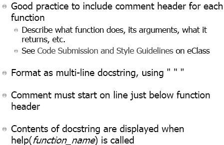

# Lecture 6

## Function

- Statments belonged together

- Use of function is come from experience

### Built-in Functions

- Concept of black box
	- Implementation detail (semantic, computation) is hidden (Information Hiding and Abstraction)

### Define Function

- Function identifier and its definition (lines of code / statement) are stored after being interpreted (no execution)

### Pass Args, Return Value

- Argument(s) / Parameter(s) - local varibale(s) inside the function(s)

### Call Stack

refers to the fact that
- the local variable(s) of a function only live for the lifetime of that function called (there are methods that can access the local varibale(s) outside the function)
- once that returning from that function, the local variable(s) reaches the end of its lifetime in stack order (last in first out property)
- stack is poped

#### Example

### Main Namespace

- if .py file is imported, statement(s) under if __name__ == "__main__" will not be executed

### Local and Global Variables

- Try to avoid using global variable

- name reuse, local varibale with the name same as the function is stored in different memory space / location when a function is called / invoked

- local varibale(s) hide the global one (try to avoid)

#### Example

### Updating Global Variables

- Modify a variable, it should be local variable (default)

- breaking the information hiding

### Default Values

- the order of passing args / params can be changed by invoking the name / keyword of args / params

### docstring

## Modules

- Function(s) / Global variable(s) belonged together

module_name.function1()
	- module_name - general namespace
	- function1() - specific namespace / function

- from ... import ...
	- load the functions into the current namespace

- import
	- create a new namespace under the module's name

### __name__ == "__main__"

- Protect code

#### Example

