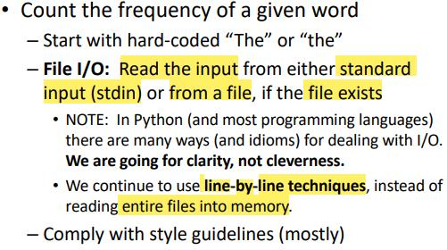
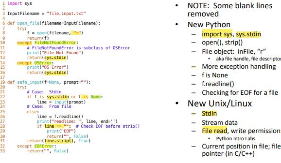
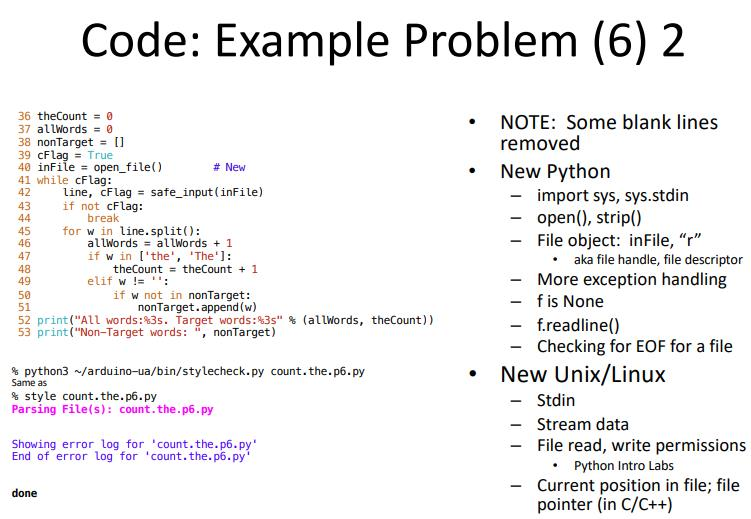
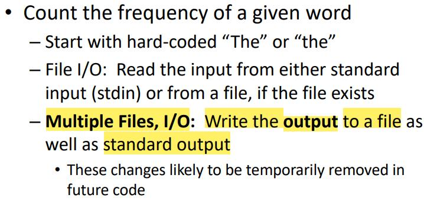
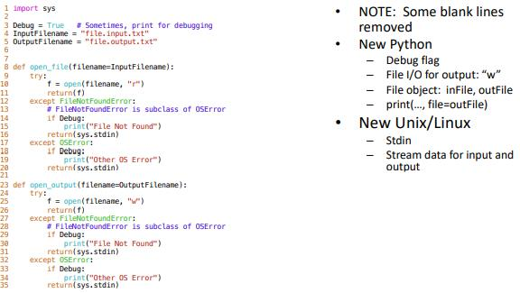
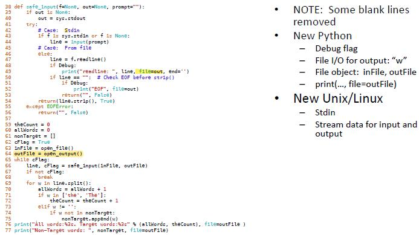
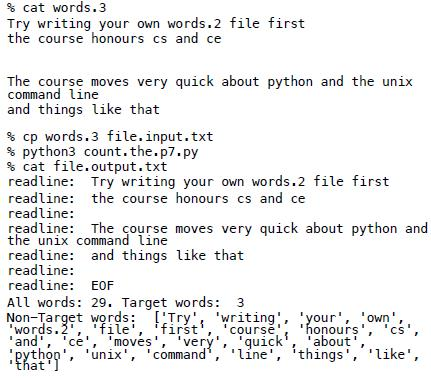
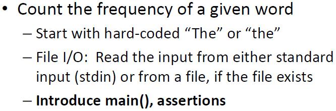
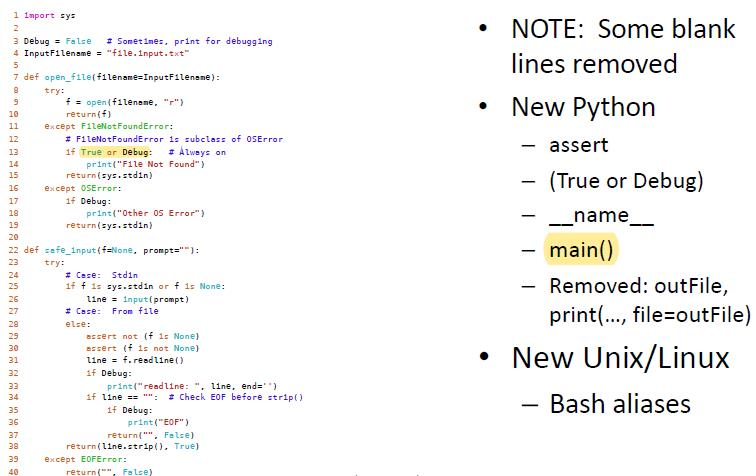
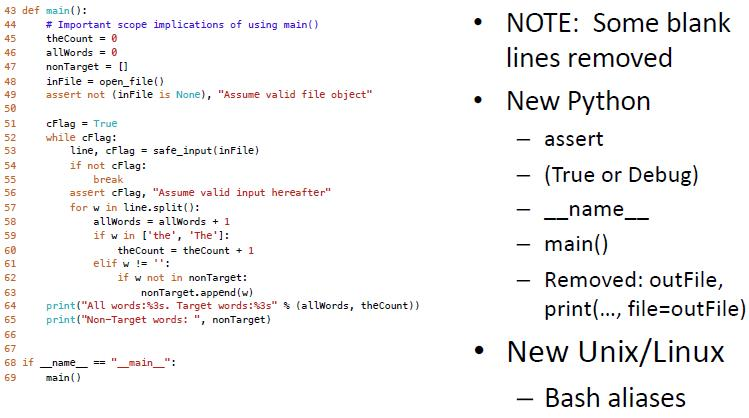

# Lecture 7

## File I/O

### Example Problem (6)

- safe_input function provide a abstraction for reading input from stdin, files, etc. (many different ways)
	- only focus on the use of safe_input, not how the safe_input actually work or is implemented
	- notice that when reading from a file, if readline return a empty, it signs that it reaches EOF of this file
	- flag, stop reading from stdin or a file if EOF is reached

- stdin, handle by OS

- file, handle by the program / source code
	- need to be opened before use, and closed after used

- read and write permissions
	- input files for read only (reading from input)
	- output files for write only (writing from output)
	- read / write for same files, referred as database

- **open_file function** 
	- variable f stores a file obj. (Java: file descriptor / handle, C/C++: file pointer)
		- either a file or stdin

	- exception handling
		- if the input file wanted to read does't exist, or the process of reading input from a input file fail
		- fall back to using stdin

- *is*, instead of testing for value equality, it tests for object identifier equailty (whether if it is the same object)

- strip(), in this case, it removes the invisible character (not space - ""; space - " ") at the end of each line (newline)

### Example Problem (7)

- print()
	- file parameter specific where the output goes (default, stdout)

- if discover examples that can cause bugs, and fix these bugs, try to keep that test files for test cases of these specific bugs

### Example Problem (8)

- Use of "True or Debug (Debugging flag)" (use occassionally) - some debugging codes will always be turn on???
	- Turn off debugging flag when submit assignment, morning problem, etc.

- assert - make sure certain conditions are always true
	- useful for making changes in the future although might seems to be repeated
	- invalid assumption that might not be realize

### map()
