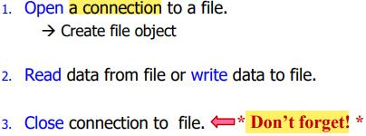
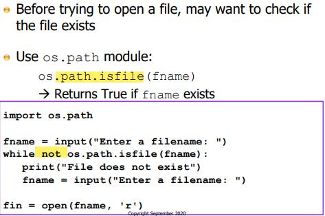
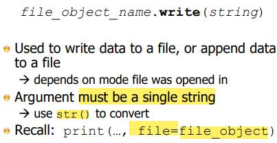
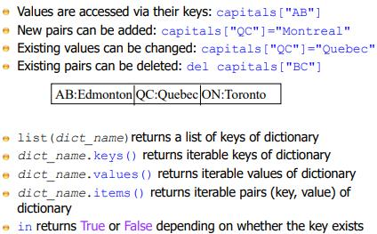

# Lecture 8

## File I/O

### Files for Input / Ouput

- The file in Pipeline is not saved

- The benefit of human readable outweight the storage cost / effeciency of using binary file

- Binary file (database, compressed files, jpg., etc.)

### Using Files

- Initialization (prepration / create) before use (high overhead operation)
	- Python cannot access file (required OS and underlying sys.)

- Closing connection (Finalization)

### Open File

- append mode usually is used for logging and other situations

- binary mode
	- the invisisble character in the file (e.g: newline) is not processed by Python
	- readline: line by line way of processing the file, Python and OS interprets where the line ends (newline character)
	- binary mode interprets by number of bytes

- In Windows, when a text file is created and written out, it is different from other OS.
	- MacOS, Linux, a line of data in a text file ends with a newline (one char)
	- Windows, a line of data in a text file ends with a newline and a carriage return (two char.)
	- in binary mode, the difference between Windows and non-Windows textfile become visible (text mode, sys. will handle automatically)
	- also, an extra invisible char, Windows / DOS format text file will be carried when transform between Windows and non-Windows sys.

### Check if File Exists

### Methods to Read from File

 

- size chars. - utf-8, ascii

- readlines for large file (some known adv. and disadv.)
	- require large memory storage, significant latency during reading and writing into memory 
	- but once is being read into memory, it can be accessed very quickly

**Recommendation** 

- design the file format / file IO such that read it line by line (many modules and functionality support line by line processing)

- file format be json (javascript object notation) or well-known format based on text files that has many modules support to it

#### Example

 

**Example 1** 

- allow python program to be executing on a earlier line of the file while th later line of file will be brought into memory by the OS / python
- overlapping the processing of the file with the reading of the file (prefetching)

**Exmaple 2** 
 
- *file_object*.read() will read the entire file into memory
- somehow equivalent to readlines
- can be go backward (since alist is a list)

### Writing to File

### Close File

- Release buffer / memory to OS / VRAM

## Dictionaries

- C++ - hashmap (emphasize the implementation of this data type); other programming language - key value stores

- Make dictionaries fat to use, fast to access by hash table
	- Take a key value
	- Instead of look for it by one by one checking to see which value is assoicated with this key (linear search), use hash function to computes the key to a special number called a hash value and then it checks in that data strcuture at that special number or value
	- A well-designed hash table can find data far more quickly than searching the data strcuture
	- There's overhead. Hashmaps and hash table don't search by lookup

### Built-in type: Dictionary

