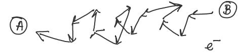

# Lecture 3

## Passive Elements

1. Resistors: absorb electrical power and disspate in the form of heat (light bulbs, eletric heates)

2. Inductors

3. Capcitors

2 and 3 temporarily store electrical energy

### Resistors

What is the relation between $$I_{AB}$$ and $$V_{AB}$$?

For metallic systems, in general, $$V_{AB}$$ is proportional to $$I_{AB}$$ or $$V_{AB} = R I_{AB}$$, which is Ohm's Law

Note: Ohm's Law may not be always valid

$$R = $$ constant of propotionality: "Resistance"

### Microscopic origin of resistance

- These ions / atoms are not static. They vibrate about their mean position of rest due to thermal energy

- As $$e^{-}$$ flow inside a metal wire, they lose energy and momentum due to interactions ("collisions") with impurities and the lattice vibrations. This explains the energy loss of the

- This lost energy is transferred to the material $$\rightarrow$$ the material gets hot, which implies
	- lattice ions vibrate more
	- more collisions with $$e^{-}$$ 
	- higher $$R$$

### R Dependent Factors

R depends on the following factors:
- Material property 
	- more free electrons $$\rightarrow$$ less resistance; e.g: metal
	- less free electrons $$\rightarrow$$ more resistance; e.g: plastic or ceramic
- Dimensions of the material
	- higher volume $$\rightarrow$$ more $$e^{-} \rightarrow$$ less resistance
	- higher volume (adding extra material, also introduce more ions atoms / ions) $$\rightarrow$$ more collisions $$\rightarrow$$ higher resistance
- Temperature (T)
	- The material gets hot $$\rightarrow$$ lattice ions vibrate more $$\rightarrow$$ more collisions with $$e^{-} \rightarrow$$ higher R
	- as T increases, R increases (metallic systems)

- $$R = \rho \frac {l}{A}$$
	- $$\rho$$, resistivity (material properly , function of T (Temperature))
		- Resistivity value is obtained from experiment
	- $$l$$ length, meter (m)
	- $$A$$ cross-section, ($$m^2$$)

- Relationship of length, cross-section and resistance

#### Examples

- Ex 1:

- Ex 2:

### Circuit Model of Resistors

- Circuit model ignores the details of the wire (material, dimensions - cross areas, distance / length between entrance and exist)
	- only mentions the "lumped" or "composite" varibale R (lumped Component Approximation, LCA)
 
- $$R = \rho \frac {l}{A}$$
	- Resistance is "distributed" over the entire volume of the wire

- But in the circuit model, resistance is lumped in the ZigZag region

- Related with voltage, current and power

- As $$i$$ or $$v$$ increase, then $$p$$ increase, then resistor becomes more hot $$\rightarrow$$ more $$e^{-}$$ collisions inside the material $$\rightarrow$$ higher resistance

- Note: open circuit and arching

- Ideal region or operation: linear region (where Ohm's law is valid)

- Every resistor comes with a power limit specification ($$P_{max}$$) (specified by the mancfactuer)

#### Example

### Mechanical analogy of LCA

