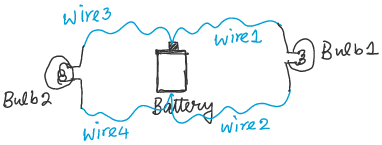
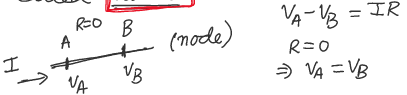

# Lecture 4

## Circuit Analysis Using Lumped Component Approximation

- Battery is modeled by an indep. voltage source ($$V_0$$). can be viewed as "**lumped**" representation of the actual battery since all the **internal chemistry** of the battery is **ignored** and we are using the lumped value $$V_0$$

### Analysis (ECE 202)

A circuit or a system is given.

We are aksed to find out how the circuit or the system behaves (no assumption, no given information, everythin is unknown)

- **remark:** don't assume the direction of the current, don't consider positve and negative

### Synthesis (Opoosite of Analysis)

Desired circuit behavior (system behavior) is given

We are aksed to create the circuit (system) that exhibits such behavior

## Node

- In a **lumped model**, various lumped elements are connected each other by **perfectly conducting** (**zero resistance**) segments.

- Such zero resistance regions are called **nodes**.

- Within a node, there is **no change** in voltage.

- Each node has an unique "**node voltage**" which **does not vary from** one point to another winthin that node.

- **Shape** of the nodes can be **changed arbitrary** without **affecting the electrical variables** inside the circuit

**Important** : Circuit description (or circuit toplogy)
- How many nodes? (Label The Nodes)
- How the componenets are connected between those nodes?

#### Example

- Previous Example:
	- 6 nodes
	

- Using this description, many different layouts can be for the same circuit.

#### Possible Alternative Layouts

**Important**
- Arrow directions mean the direction of travel (**no the direction of the current**, the direction of travel or path can be arbitrary)

or

Although the connection and layout is different, it is same from the electrical point of view

Simplfy a cirucit with complicated layout into much more simple or clear one.

### Loop

A **loop** is any closed path through the circuit in which **no node** is encoutered **more than once**

### Mesh

The number of Mesh is not always the same (depends on the direction / way of travel?)

Mesh is a loop that does not **contain any other loop** within it. ("smallest size loop")
- strictly follow the characteristic of the loop

### Branch

Any **lumped element** can be viewed as a branch.

#### Examples

- Purple, dark green, pink / red:  The direction of travel or path $$!=$$ the direction of the current

- Light green: Mesh

- not a valid loop because 2 has been visited twice

- number of branches = 7

**Remark**:

- number of branches and # of nodes in a circuit are constants

### Kirchoff's Current Law (KCL)

Applied on nodes ...

$$\sum$$ Currents entering a given node = $$\sum$$ Currents leaving that node

Aet: Algebraic sum of all currents leaving a node is zero.

**Important:** A circuit with N nodes with have $$(N-1)$$ linearly indep. KCL equations

#### Example

Write KCL for every node

Eqns (1) - (5): linearly dependent

Check:

### Kirchoff's Voltage Law (KVL)

... applied on meshes and loops

Around any closed path (mesh and loop)

$$\sum$$ Voltage drop = $$\sum$$ Voltage rise

Aet: Around any closed patgh (meshes and loops) algebraic sum of all voltage rise (or drop) is **zero**

#### Example

- red - meshes

- green - loop and direction of travel

**Important**
- Arrows mean direction of Travel (NOT the direction of current)

KVL for **inside the loop** (Meshes)

**Left Mesh**: A - B - E - F [Direction of travel does not matter]

KVL:

**Rigth Mesh**:

KVL:

KVL **around the outer loop**

**Important**
- Note that Eq(1) + Eq(2) $$\rightarrow$$ Eq(3). All these KVL equations are not linearly indep.
- In a circuit with N nodes and B branches, # of indep. KVL equations $$= B - N + 1$$ 

check:

