# Lecture 5

## Common Circuit Connections

1. Series connection
2. Parallel connection
3. Y connection (aka "star" connection)
4. delta connection

### Series Connections

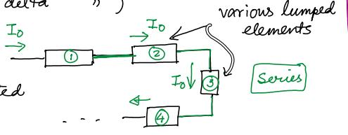

Two conditions both need to be satisified:

- Elements **must** be connected **end- to -end** with one common node

- **Same current** (or **same charge**) must physically flow through each element. No part of the current **escapes** and no new current is added

#### Example

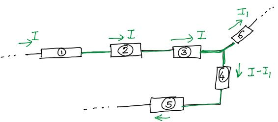

- Elements 1, 2, 3 are in series

- Elements 4 and 5 are in series

- Elements 3 and 4 are not in series

#### Cases I:

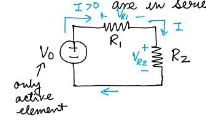

- A voltage source and two resistors are in series
	- $$V_0$$ is the active element

- Apply KVL: $$V_0 = V_{R_1} + V_{R_2}$$

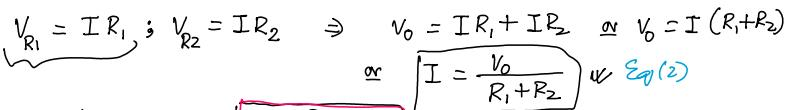

- Applied voltage gets divided across the resistors
	- "**Votage Divider**" circuit

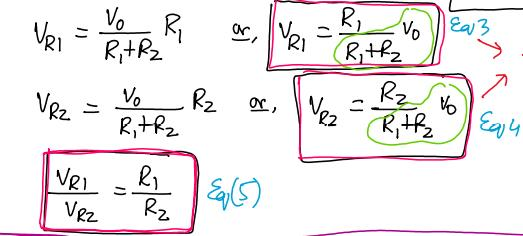

**Applied voltage** $$V_0$$ is divided in direct proportion of the resistors

From the viewpoint of the voltage source, $$R_1$$ and $$R_2$$ in series is reuivalent ot having a single resistor $$R_eq (= R_1 + R_2)$$

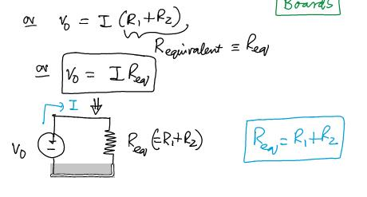

- From the viewpoint of the voltage source, $$R_1$$ and $$R_2$$ in series is equivalent to having **a single resistor** $$R_eq (= R_1 + R_2)$$

**Generalize case I** 

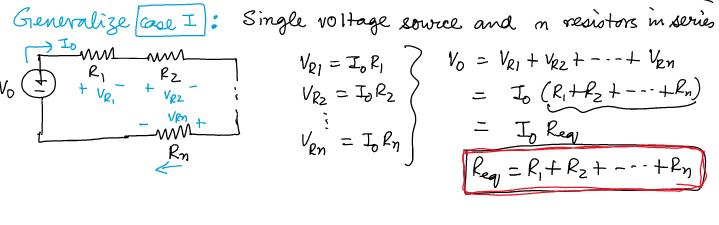

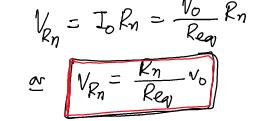

**Example** 

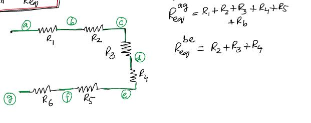

#### Practical Application: Potentionmeter

aka "**Pot**"

Ex: We have 10 V (Specification, not actual) battery. Need 4V

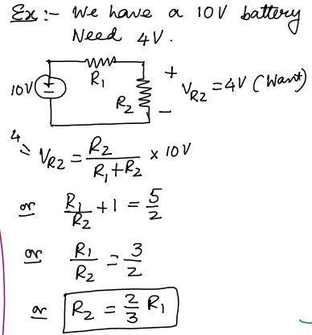

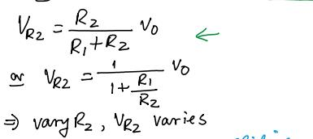

- As the slider moves, the ratio of $$R_1$$ and $$R_2$$ change but $$R_1 + R_2$$ remains constant

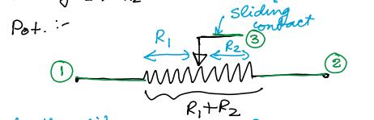

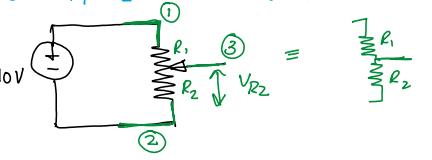

#### Case II

- m voltage sources and m resistors in series

Ex:

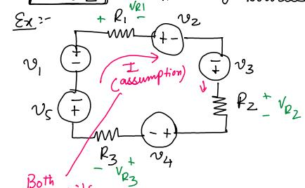

- Both "I" and its direction are assume

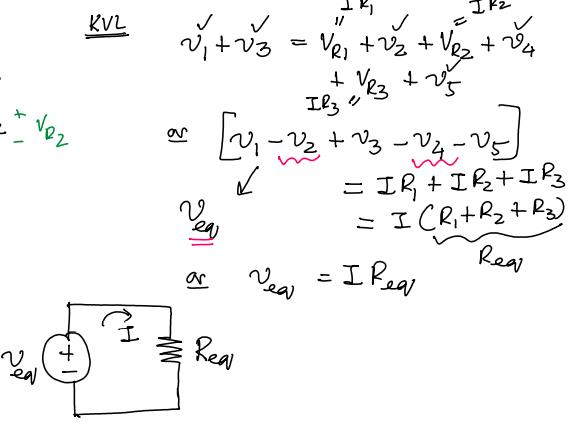

#### Example

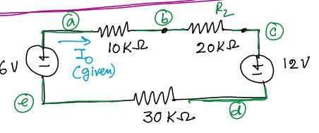

Find $$I_0$$ and find $$V_{bc}$$ (Voltage across $$20K \Omega$$)

Solution

- Find $$R_{eq}$$ and $$V_eq$$ 

$$R_{eq} = 10 + 20 + 30 = 60 K \Omega$$

$$V_{eq} = 12 - 6 = 6 $$

$$-I_0 = - \frac {6}{60} = -0.1 mA$$ (Notice that the "-" sign is because the direction of travl of eq. diagram is reversed from the orginal

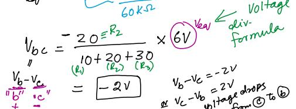

Solution (Without redirect the direction of the travel)

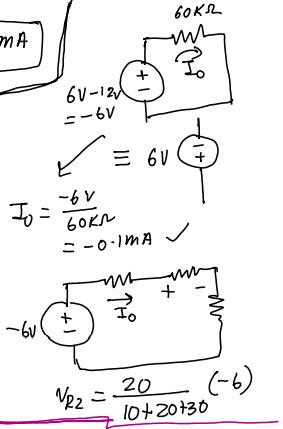

### Parallel Connection

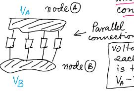

- Two or more than two lumped elements are in parallel when they are connected between the same pair of nodes

- Vlotage across each element is the same: 

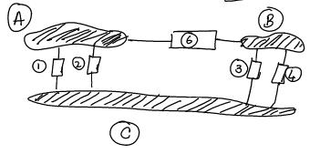

- Elements 1 and 2 are in parallel
- Elements 3 and 4 are in parallel
- However, elements 2 and 3 are not in parallel
	- element 2 is connected between node A and C
	- element 3 is connected between node B and C

#### Case I

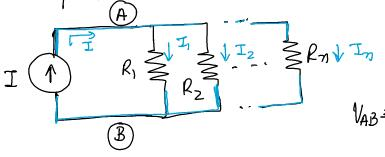

- n resistors and a current source in parallel

KCL @ A: $$I = I_1 + I_2 + ... + I_n$$

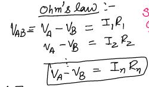

- Supply current is divided into smaller parts $$\rightarrow$$ **Current divider**

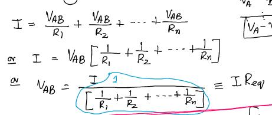

**Important** 

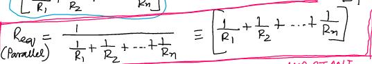

- Current is divided in the inverse proportion of the resistor value (Resistor with smaller value will carry larger share of the current)

- $$I_n = \frac {V_{AB}}{R_n} = \frac {R_{eq}I}{R_n} = \frac {R_{eq}}{R_n} I$$

- $$R_n$$ is the total resistance in the specific branch of the parallel circuit

#### Speical case

- Suppose one of the resistors is 0 $$\Omega$$ (Say $$R_n = 0 \Omega$$)

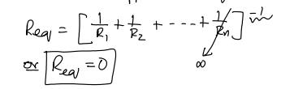

- Resistors are "shorted" by $$R_n = 0 \Omega$$ 

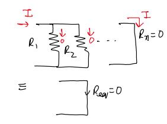

[Current take the least resistance path and flows entirely through $$R_n = 0$$ by passing all other resistors] 
