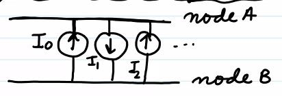
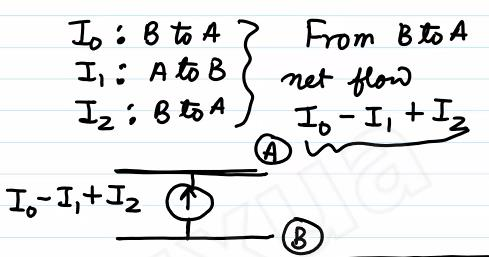
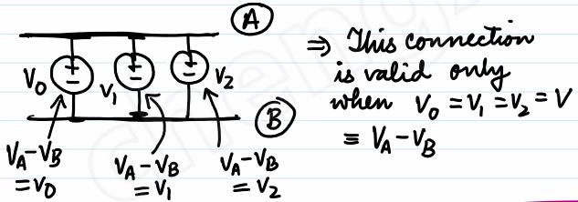
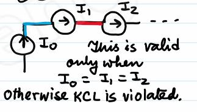
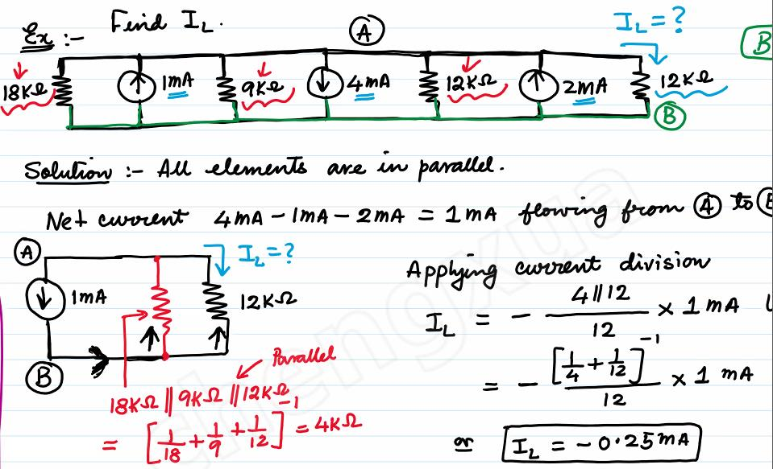
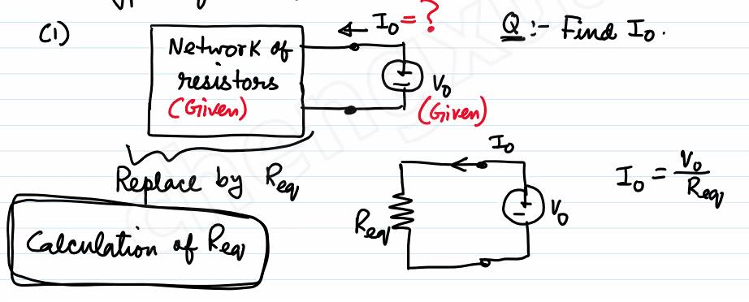

# Lecture 6

### Parallel Connection of Current Sources

### Parallel Connection of Voltage Sources

### Series Connection of Current Sources

#### Example

### Circuit Anaysis using Series - Parallel Resistors Combinations, Voltage and Current Division etc.

Two types of situation:

1)

2) Calculating voltage and current at every branch of a given network

