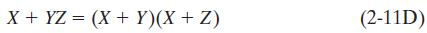

# Lecture 5

## Boolean Algebra

### 2.4 Basic Theorems

#### Example

- $$X + X^{'} = 1$$

- Example of Theorem (2-5)

- Example of Theorem (2-8D)

### 2.5 Commutative, Associative, and Distributive Laws

**Commutative laws for AND and OR**

- The order in which the vars. are written will not affect the result of applying the AND and OR operations.

**Associative laws for AND and OR**

- When two or more vars are ANDed together, the result will be 1 iff all of the vars have the value 1.
	- If any of the vars have the value 0, the result of the AND operation will be 0

- When two or more vars are ORed together, the result will be 1 if any of the vars have the value 1
	- The result of the OR operation will be 0 iff all of the vars have the value 0

#### Distributive Law

 

- Proof of 2-11D

 

- The ordinary distributive law states that the AND operation distributes over OR

- The second distributive law states that OR distributes over AND

### 2.6 Simplification Theorems

**Proof (2-13, 2-13D, 2-14D)**

**Proof (2-12, 2-12D, 2-14)**

- Theorem (2-14)

 

#### Examples

### 2.7 Multiplying Out and Factoring

- The two distributive laws are used to multiply out an expression to obtain **a sum-of-products (SOP form**

- An expression is said to be in *sum-of-products* form when all products are the products of single vars

**Remark**

one or more of the product terms may consist of a single var are still considered to be in sum-of-products form

This is not in SOF form because the $$A+B$$ term enters into a product but is not a single var

- Both distributive laws can used to factor an expression to obtain a product-of-sums form.

- An experssion is in *product-of-sums* (POS) form when all sums are sums of single vars

**Remark**

one or more of the sum terms may consist of single var are still considered to be POS form

This is not in POS form

- An expression is fully factored iff it is in product-of-sums form
	- Any expression not in this form can be factored further

#### Example
