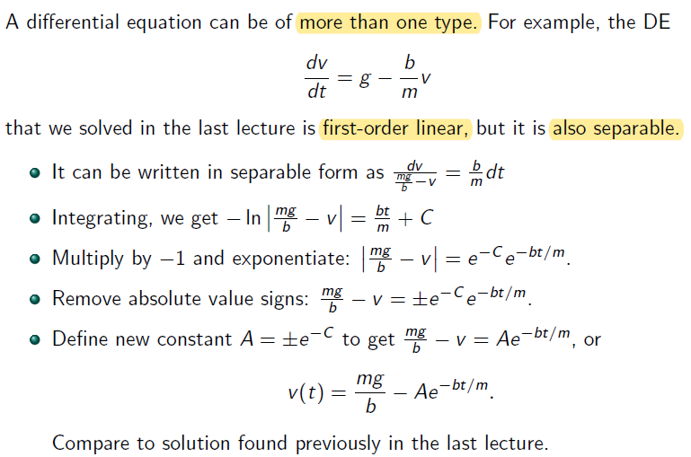

# Lecture 2

## Separable Differential Equations

**dep. var.** $$\rightarrow y$$ 

**ind. var.** $$\rightarrow x$$ 

Alternative way of writing $$y^{'}(x) = f(x)g(y) \rightarrow \frac {dy}{dx} = f(x)g(y)$$

Notice that the second $$dx$$ in $$\int N(y) \frac {dy}{dx} dx$$ is from $$N(y)$$ since $$N(y) = \frac {1}{g(y)}$$ is a function of $$y$$  where $$y$$ is a function of $$x$$

### Example

$$f(x) \rightarrow x^2$$ and $$g(y) \rightarrow \frac {1}{1+y^2}$$ in the $$y^{'}(x) = f(x)g(y)$$ 

## Implicit Form

## DEs of more than one type

- Have more than 1 method to solve

- It is first order linear because it has general form of $$y'(t) + p(t)y(t) = g(t)$$ (remember $$g(t)$$ is a constant / known term depended or not depended on ind. var. $$t$$)
	- rewrite this into $$\frac {dv}{dt} - \frac {b}{m}v = g$$, where $$g$$ can be also written as $$gt^0$$ 

- It is separable $$\rightarrow$$ rewrite this into $$\frac {dy}{dt} = \frac {b}{m}(\frac {mg}{b} - v)$$
	- $$\frac {b}{m}t^0$$ equivalents to $$f(x)$$ in $$y^{'}(x) = f(x)g(y)$$
	- $$\frac {mg}{b} - v$$ equivalents to $$g(y)$$ in $$y^{'}(x) = f(x)g(y)$$ 
