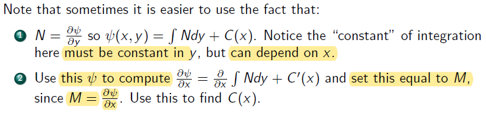

# Lecture 3

### A Soluion in Search of A Problem

$$y^{'} = - \frac {2x+y^2}{2xy}$$ 

## Exact Differential Equations

**Remark** :

- if given $$\frac {dy}{dx} = - \frac {M(x,y)}{N(x,y)}$$, don't start to apply method from separation varibale. Instead, need to start at exact differential equation

### Test for Exactness

**Side Notes** 

- 

$$\frac {\partial M}{\partial y} = \frac {\partial N}{\partial x}$$

- 

$$\frac {\partial M}{\partial y} = \frac {\partial}{\partial y} (\frac {\partial \psi}{\partial x}) = \frac {\partial^2 \psi}{\partial y \partial x} = \frac {\partial^2 y}{\partial x \partial y} = \frac {\partial}{\partial x}(\frac {\partial \psi}{\partial y}) = \frac {\partial N}{\partial x}$$ 

### Solve An Exact DE

- Use $$M$$ and $$N$$ to obtain $$\psi (x,y)$$

#### Examples

- Example 1

- Example 2

### Review Partial Differential

Notice that $$\frac {d\psi}{dx} \ne \frac {\partial \psi}{\partial x}$$
