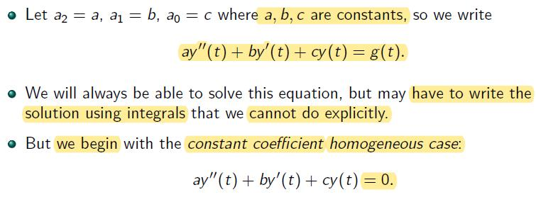
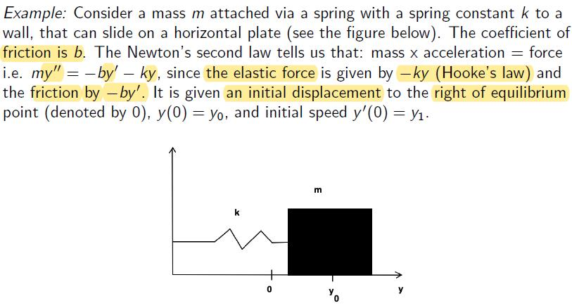
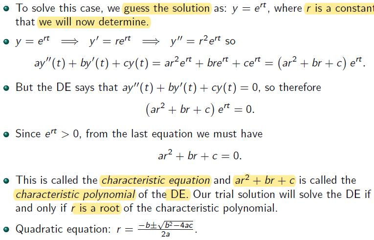
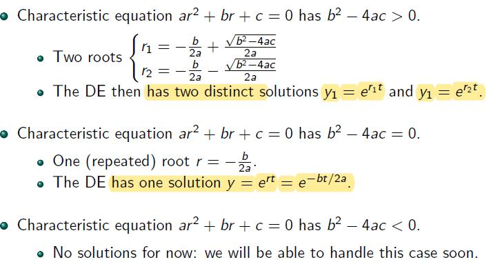
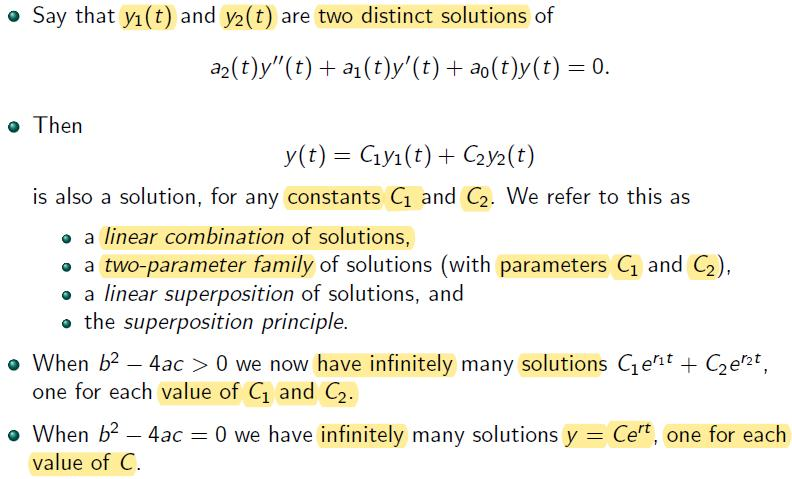
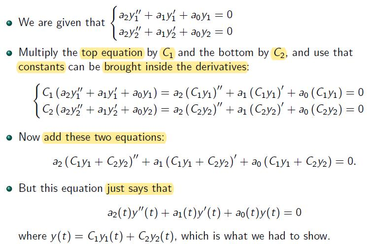
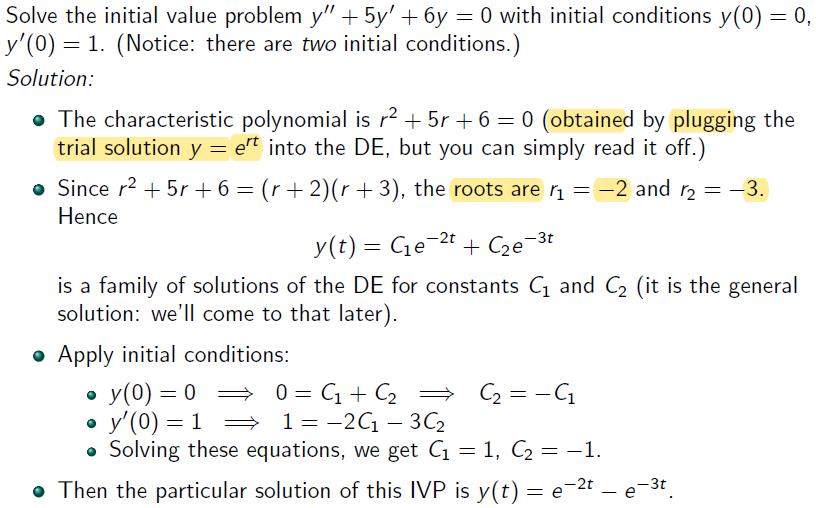
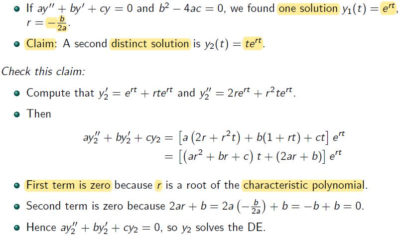
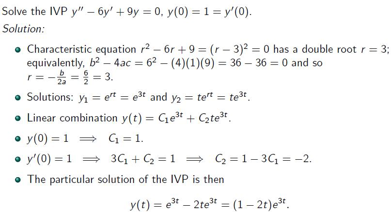

# Lecture 4

## Second Order Linear ODEs

- $$q(t) = \frac {a_0}{a_2}$$ 

- $$p(t) = \frac {a_1}{a_2}$$

- $$g(t) = \frac {b(t)}{a_2}$$

### Constant Coefficient Case

- This equation is not homogenous

#### Example

- Recall: $$y^{''}$$ is accleration, ..., $$y$$ is displacement

- Rewrite: $$my^{''} + by^{'} + ky = 0$$, then $$y^{''} + \frac {b}{m}y^{'} + \frac {b}{m}y = 0$$ 

- If it is not at eq. point, it need to be adjust

### The Trial Solution $$y = e^{rt}$$

### The Three Cases

- n (real number) Linearly indep. sol. whose linear combination gives the general sol.

### Linearity: Infinitely Many Solutions

 

- The (general) solutions of a 2nd order ODEs can be expressed as the **linear combination** of two distinct solutions of this 2nd order ODEs, $$y_1(t)$$ and $$y_2(t)$$, with two constant $$C_1$$ and $$C_2$$, when the characterstic equations $$>$$ 0.

#### Proof

#### Examples

- Example 1

Solution

- Example 2

Solution

 

### The Case of $$b^2-4ac=0$$ 

#### Example

### Summary

 
