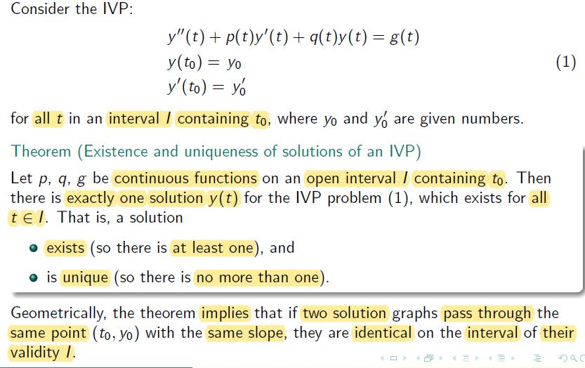
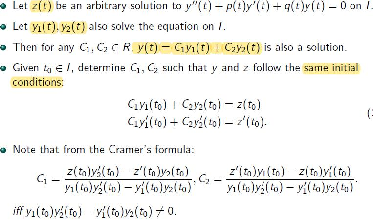
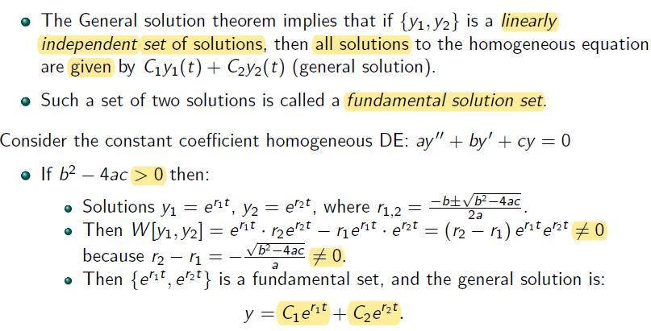
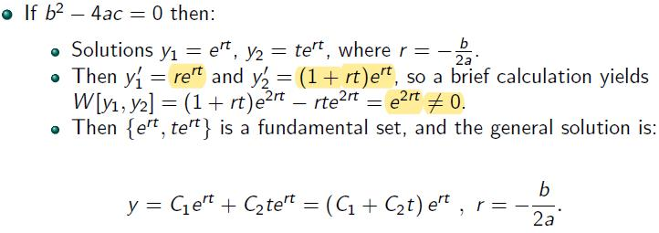
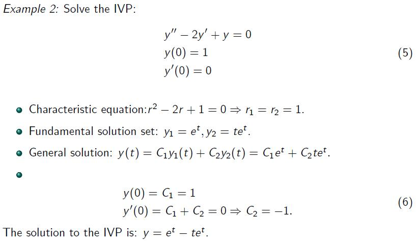

# Lecture 5

## Existence and Uniqueness Theorom of an IVP

### General Solution to Homogeneous Equations

 

iff - if and only if

- proof $$y$$ and $$z$$ are identical (given that $$y \ne z$$ but they both satisfy init. cond.)
- $$y(t_0)=z(t_0)$$ 
- $$y^{'}(t_0)=z^{'}(t_0)$$

$$W \lbrack y_1, y_2 \rbrack (t) = det \begin{pmatrix} y_1(t) & y_2(t) \\ y_1^{'}(t) & y_2^{'}(t) \end{pmatrix} = y_1y_2^{'} - y_1^{'}y_2$$ 

#### Simple Meaning of the Wronskian

### Fundamental Sets of Solution

#### Examples

