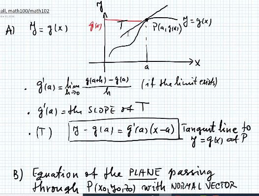
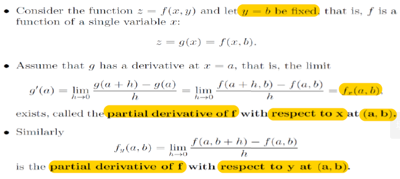

# Lecture 3

## Partial Derivatives. Tangent Plane

### Recall: Concept from 100 and 102

- **Definition of Derivaitves** 

- **Plane and Normal Vector** 
	- There is **only one** plane that passes the point P and normal to the **Normal Vector** $$N$$

- **Vector Equation** 

- vector $$V = <a, b, c>$$ is direction vector

- There is only one plane that pass through point P and process the **Normal Vector** 

### Definition of Partial Derivatives. Tangent Plane

#### Geomertric Interpertation

$$f_x(a, b) \rightarrow$$ slope of tangent line (y is fixed, derviative of f with respect to x) at point $$(a, b)$$ on **curve** $$C_1$$ (equivalent to $$z$$ or $$f(x,y)$$?)

- **curve** $$C_1$$ $$\rightarrow$$ intersection of vertical plane $$y = b$$ with **normal vector (0, 1, 0)**  and the surface $$x(x,y, f(x,y)$$
	- vertical plane $$y=b$$ parallel to xz plane, cut surface with the vertical plane along curve $$C_1$$
	- curve $$C_1$$ is in the vertical plane and on the surface

- Simiarly, the above applied to $$f_y(a, b)$$ that indicates the slope of tangent line $$T_2$$ (x is fixed, derivative of f with respect to y). The intersection of vertical plane $$x=a$$ and the surface produce curve $$C_2$$

- Tangent line will have direction vector

- Direction vectors of two tangent lines $$T_1$$ and $$T_2$$ of two curve can span a plane, which is **tangent plane**
	- the tangent plane touches the surface at only point P

- Normal vector of tangent plane is normal the direction vectors of two tangent line $$T_1$$ and $$T_2$$
	- normal vector with point P can produces a normal line that crosses the tangent plane (normal to the tangent plane)
		- normal vector is **direction vector** of normal line

#### Eqautions of $$T_1$$ and $$T_2$$

- requires:
	- point $$P$$ (a, b, f(a, b))$$
	- direction vector

- then, set $$x-a=t$$ or $$y-b=t$$ (Recall line equation with direction vector - MATH 102)

#### Normal Vector N and Tangent Plane

#### Normal Line

### High Order Partial Derivatives

#### Examples

**Solution**:

### Clairaut's Theorm

