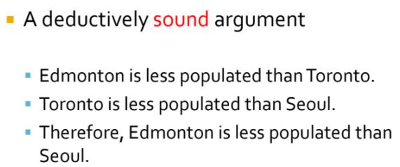
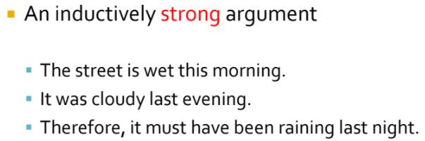
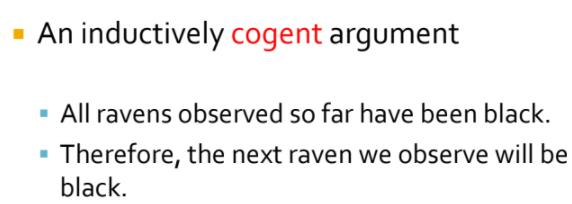

# Chapter 2

## Deductive and Inductive Arguments

All arguments are intended to support the truth of their conclusions, but args can be structured in vastly different ways to achieve this goal

- Logical structure matters, and determines the degrees to which reasoning from true premises ensures a true conclusion 

	- the struct. and the quality of premises determine whether and to what extent this support is effective

- **Form**, the techincal terms of the strcuture of arguments

- *Truth Preserving*, the flow of truth from premises to the conclusion

Truth is *preserved* through the inference

- In a good argument, true premises are worded and orgainzed in a way that guarantees or makes it very likely that the conclusion is true

	- the truth of the premises in a good argument flows into the conclusion (args' structure or form matters, is critical)

### Deduction

- two ways to poorly constructure a argument
	
	- n <= 1 premises - the materials out of which the arg is built - is **false**

	- the structure or form of the arg fails to provide **adequate support** for the conclusion

- **Deductive arguments**, who functions **properly**, are *fully* truth preserving are the strongest sort.
	- It is said to be *deductively valid* when a deductive arg is **properly structured**.
	- It is called a *deductively sound arg* when a deductively valid arg has **true** premises
	- The premises are intended to support the conclusion with certainty
	- The truth of the conclusion will *necessarily* follow from the truth of the premises

**Important** : A deduction is speech in which, **certain things** having been **supposed**, something **different** from **those that are supposed** results *of necessity* (必然地) because of their being so.
 

#### "Necessarily" / "of necessity"'s meaning in the context of logic

- the conclusion of a valid deducitve arg will "definitely follow", "is sure to follow", or "certainly follows"

	- the trurh of the conclusion is entirely supported through the arg's struct. and by the truth of premises

- Another way to put this is to say that a properly structured deductive arg is constructed so that it is impossible for the conclusion to be false *if the premises are true* (if the premises aren't all true, all bets are off)

- An arg. is not **fully truth preserving**, when the truth of the premises **doesn't entirely guarantee or ensure** the truth of conclusion, the arg is *deductively invalid*.

### Induction

- **Partially truth preserving**

	- These arguments do not guarantee their conclusions, but they do give them enough support that they should be taken seriously

- The premises are intended to **provide strong support** for the conclusion

- The conclusion is highly probable (很可能的) if the premises are true

	- The likelihood of the truth of the conclusion being true is very high if the premises are true
	- but never say the conclusion must be / guarante to be true although all the premises are true or give very good reasons to accept the truth of the conclusion

- A successful (well-structured) inducitve argument is called inductively **strong**

	- the truth of the premises makes it very *likely that the conclusion is true*

- *Inductively weak args* are args ub which the truth of the premises does not **lend** much support to the conclusion

	- not enough support for the conclusion - unreasonable to accept the conclusion based solely on the premises

- An inductively strong arg with all true premises is called an inductively **cogent** (有说服力的) arg.

### Summary

- Deductive arg is either decutively valid or invalid
	
	- If it's valid, it is either sound or unsound

- Inducitve arg is either strong or weak
	
	- If it's strong, it is either cogent or not cogent

- In a deducitvely valid arg, the information of the conclusion is **contained** in the information of the premises.

- In an inductively strong arg, the information of the conclusion goes beyond the information of the premises
	
	- sometiemes called ampliative (扩充的) arg

**Remark** 

- A deductive arg may contain premises that make **probability claims** yet still be a deductive arg.

	- It's not the content of the premises but **the way they're related to one another** (thier structure), the kind of inference they make

#### Examples

- valid - strcuture, although one premise is false

- not sound

	- the conclusion is contained in the information of premises, the truth of the premises is already guarantee the truth of conclusion

- invalid - the strcuture is prbolematic

	- it's deducitve because the premises and conclusion are structured in a way that the premises are intended to fully support the conclsuion
	- the premises are true but the conclusion is **false**

## Conditional Claims

- a type of complex claim in whic the truth of one claim (the consequent -  后件, 推断), somehow **depends upon** or is contigent upon the truth of another claim (the antecendent - 前件)

- often articulated in the form "if *p*, then *q*"
	
	- *p* and *q* can themselves be either simple or complex claims

	- In the common, "if *p*, then *q*" form, *p* is the antecedent and *q* is the consequent

*In the minimal sort of relationship between antecedent and consequent, a conditional claim asserts simply that when the antecedent is true the consequent is also true*

- A conditional is false when its antecedent is true and its consequent false; otherwise, it is true

**Remark** 

- simply by being conditional claims, do not imply any particular type of relationship btw. the antecedent and consequent, causal of toherwise - and so neither do statements of ncessary and sufficient conditions.

### Conditional Claims in Deduction

- The relationship btw. the premises and the conclusion of a deductively valid arg may be expressed thoruhg a coditional claim.

	- often describe this relationship: "If the premises are true, then the conclusion is true"

- Valid deductive arg are conditional claims where the antecedent (the premies) is connected to the consequence (the conclusion) in a particular, logical way called *entailment* (something that is inferred)

- A unique and important feature of conditional statements is that they only proceed in one direction
	- can't run the inference in the other direction once the direction is detemrined (not always p to q)
	- "if *p*, then *q*", the truth of q follows from the truth of *p*, but the truth of *p* does not follow from the truth of q

### Necessary Conditions

- *necessary condition* is a state of affairs that must occur for another state of affairs to occur

- often indicated by the "only if"

	- e.g "We'll go to the movies if you clean your rooms" and "We'll go to the movies only ifyou clean your rooms". 
	- 1st instance, there might be other conditions under which the family goes to the movies (snow or rain, persuasion, etc.)
	- 2nd instance, "only if" establishes an exclusive condition that must be met, without which ( $$/leftarrow$$ the exclusive condition) the antecedent won't be true

- *The component statement designated by the phrase “only if ” is the necessary condition of a conditional claim* 

**Remark**

- 'if' is the sign of the antecedent; 'only if' is the sign of the consequent ?

#### Example

the presesnce of breathable oxygen is a necessary condition for humans to live, which means humans must have breathable oxygen in order to live.

Written in terms of "if p, then q" - "If humans are living, then breathable oxygen is present."

Therefore:

	- The consequent of an "if... then..." statement is the necessary condition for the antecedent

**Remark** 

- "if *p*, then *q*," the truth of *p* is claimed to correlate with the truth of *q*
	- a true *p* is claimed to imply that *q* is also true

- refer to the example, the presence of breathable oxygen does not reuslt in humans living (need more than oxygen to live)
	- the presence of breathable oxygen alone is not enough to know that humans can live

### Sufficient Condition

- a condition that when met is enough to know that some other condition has also been met.

- *The antecedent of an “if…then…” statement is the sufficient condition for the consequent*

**Remark** 

- e.g: A black mail who says, "I'll not go to the police with the incriminating information I have about you only if you give me the money"

	- this has not said that giving him the money will result in his not informing the police
	- he has not said, strictly speaking, what will happen if *the money is paid*
	- the blackmailer has made the much more limited claim that *if the moeny is not* paid he will inform the police
	- paying the blackmailer is necessary for his not going to the plice, but it's not suffcient to guarantee it

### Biconditional Claims

- A *biconditional claim* is a complex claim that expresses a relationsip of equivalence btw. two claims. 

	- Two claims are considered *equivalent* in this logical sense, when they always have the saem truth value (both true or both false)

#### Example

"Suzy will get a raise if and only if she gets a promotion"

- "if and only if" -  denote the biconditional relationship btw. Suzy's getting a raise and Suzy's getting a promotion.

## Classifying and Comparing Claims

### Comparing Claims

1. Consistency

	- about things fitting together in a way that makes sense
	
	- *In logical terms, consistency is a term used to describe a set of claims that can all be true at the same time*
	- *Inconsistency*, occurs within a set of claims when it is not possible for all of the claims to be true at the same time. 

2. Contradiction (inconsistent)

	- A contradiction occurs btw. two claims when the truth of one necessitates (使成为必需, 迫使) the falsity of another, and the falsity of one necessitates the truth of the other

	- occur when for logical reasons two claims must have *opposite truth* values, and so one must alwasys be false while the other is true.

	- Contradictory statements can never have the **same truth values** at the same time

3. Contrariety (inconsistent)

	- Contraries are also inconsistent

	- A relationship btw two claims that occurs when at least one of the claims must be false
	
	- impossible for both claims to be true at the same time

	- Compare to contradiction, contrariety not allow two claims that are true together but can both be false.

4. Equivalence

	- describes a relationship btw. two claims that always have the same truth value.

	- If one claim is true and equivalent to another claim, then the other claim must be true as well

	- If one claim is false and equivalent to another claim, then the other claim must be false as well

### Classifying Single Claims

1. Contingent Statements

	- can be either true of false

	- staments that **possibly** true or false

	- to be contingent, require that it is *possible* in some circumstances it is true and in some other *possible* circumstances it is false

2. Self-contradictions

	- under all possible circumstances they alwasy posses the same truth value - false

	- also always equivalent to one another

## Claims and Definitions

Recall: Claims, are assertions about what is true or false, but they would be vacuous if the words that composed them didn't have specifc meanings

### Lexical

- Using one set of words to define anohter word (group of words) is called *lexical definition*

E.g: pony = a small horse

### Stipulative

Potential problem: dictionaries often simply report on the way a word is commonly used, which can nevertheless be conceptually problematic and can change significantly over time

- specifying a particular meaning for a term

- a new or more precise meaning for a term is simply stipulated - a *stipulative definition* 
	- more precise, more accurate, and often more enduring definitions

E.g sound = a valid argument with true premises

### Ostensive

- Pointing to an instance of the reference of a term

- pointing to something that is more complex or impossible to define wihout an instance in experience

E.g: That is a bike. She is Grace

### Negative

- Defining something by what it is not
c
E.g: God is not ignorant.
