# Lecture 4

## Number Systems & Conversions

### Decimal (Base 10)

- use a positional notation
	- each digit is multiplied by an appropriate power of 10 depending on its position in the number

#### Example

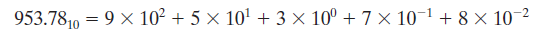

### Binary (Base 2)

- each binary digit is multiplied by the appropriate power of 2

#### Example

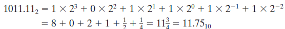

**Note**: Binary point separates the + and - powers of 2 in same way of decimal number

### Power Series in R

- Any postive integer $$R (R > 1)$$ - the radix or base of a number system

- If the base is $$R$$, then $$R$$  digits (0, 1, ..., $$R-1$$) are used

- A number written in positional notation can be exapnded in a power series in $$R$$
	- The power series expansion can be used to convert ot any base.

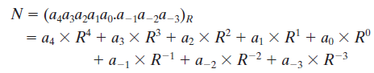

- where $$a_i$$ is the **coefficient** of $$R^i$$ and $$0 <= a_i <= R-1$$.

### Conversion of Decimal to Base $$R$$ (Division Method)

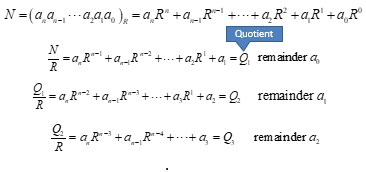

- This process is continued until finnally obtain $$a_n$$

**Note**: the remainder obtained at each division step is **one of the desired digits** and **the least significant** is **obtained first**

#### Example

**Base 8 to Decimal** ($$R = 8$$)

- required digits are 0, 1, 2, 3, 4, 5, 6 and 7.

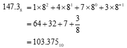

**Base 16 to Decimal**

**Convert 53_10 to binary**

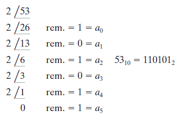

### Conversion of Decimal Fraction to Base $$R$$ (Successive Multiplication by $$R$$ )

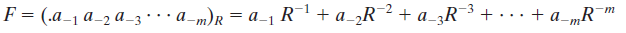

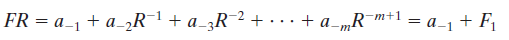

- $$F_1$$ represents the **fractional part** of the result and $$a_{-1}$$ is the **integer part**

- Multiplying $$F_1$$ by $$R$$ yields

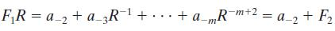

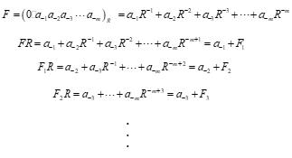

- This process is continued until obtaining a sufficient number of digits

**Note**, the integer part obtained at each step is one of the desired digits and **the most significant digit** is obtained first

#### Example

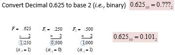

- This process does not always terminate, but if it doesn't terminate, the result is a **repeating fraction** 

### Number of Binary Bit

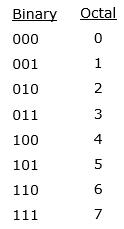

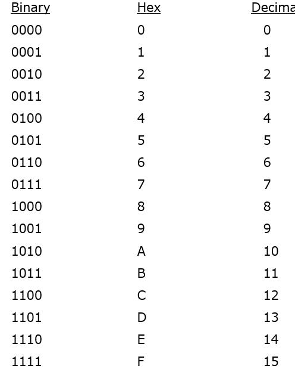

- For hexadecimal, the bits are divided into groups of four, and each group is replaced by a hexadecimal digit

#### Example

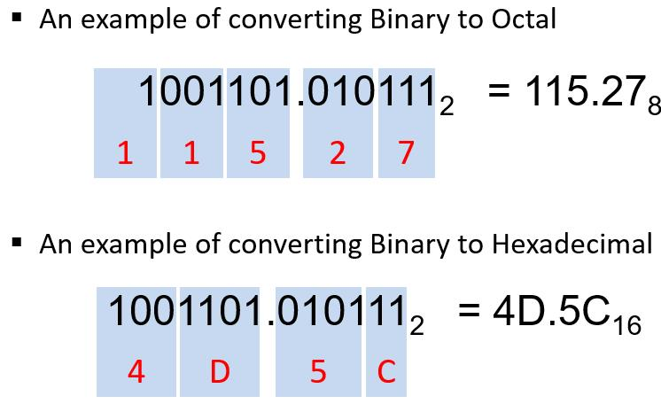

## Binary Arithmetic

### Addition

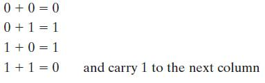

- Carring 1 to a **column** is equivalent to **adding 1** to that column

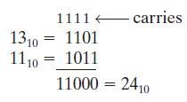

### Subtraction

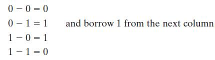

- Borrowing 1 from **a column** is equivalent to **subtracting 1 from that column** 

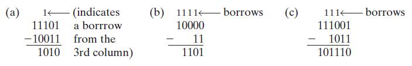

- Example 2: in order to borrow 1 from the second column, we must in turn borrow 1 from the third column, etc.

### Multiplication

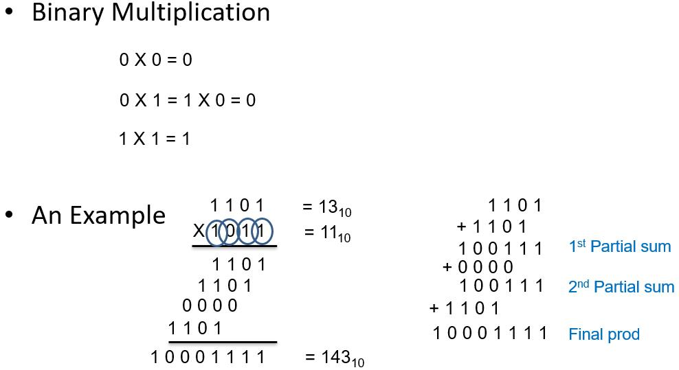

### Division

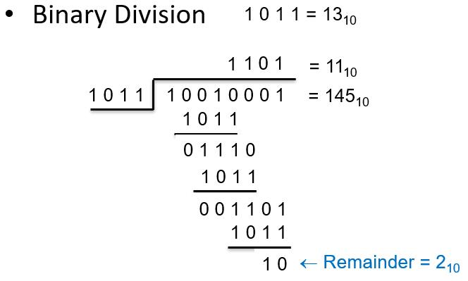

## Representation of Negative Numbers

Three system to generate a negative number

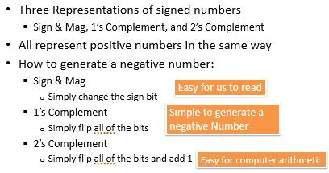

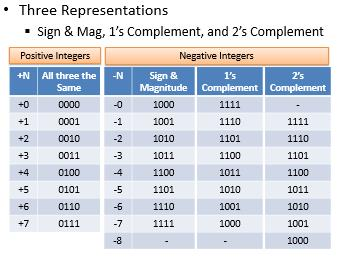

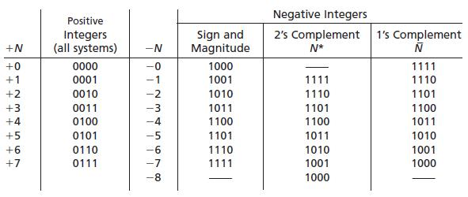

### Sign and Magnitude System

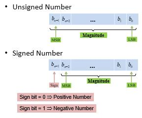

- To represent both + and - numbers, first bit in a word is used as a sign bit (0 for plus and 1 for minus)

- For an n-bit word, the **first bit** is **the sign** and the **remaining n - 1 bits** represent the **magnitude** of the number

- an n-bit word can represent any one of $$2^{n-1}$$ positve integers or $$2^{n-1}$$ negative number

### 2's Complement Number System

- a + number, $$N$$, is represented by a 0 followed by the magnitude as in the sign and magnitude system

- a - number, $$-N$$, is represented by its 2's complement, $$N^{*}$$ 
	- If the word length is n bits, the 2's complement of a postive integer $$N$$ is 

$$N^{*} = 2^n - N$$

- 2's Complement does not have 0 because postive number already includes (+)0

**Example** 

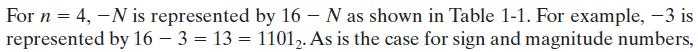

### 1's Complement Number System

- $$-N$$ is represented by its 1's complement $$\overline{N}$$ 

- The 1's complement of a positive integer $$N$$ is defined as

$$\overline{N} = (2^n - 1) - N$$ 

### (Dis)Advantage of Three Representation in Addition and Subtraction

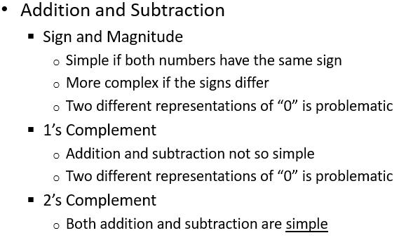

### Addition of 2's Complement Numbers

- The addition is carried out just as if all the numbers were positive, and any **carry** from the **sign position** is **ignored**

- When the word length is n bits, overflow has occured if the correct representation of the sum (inclduing sign) requires **more than n bits**

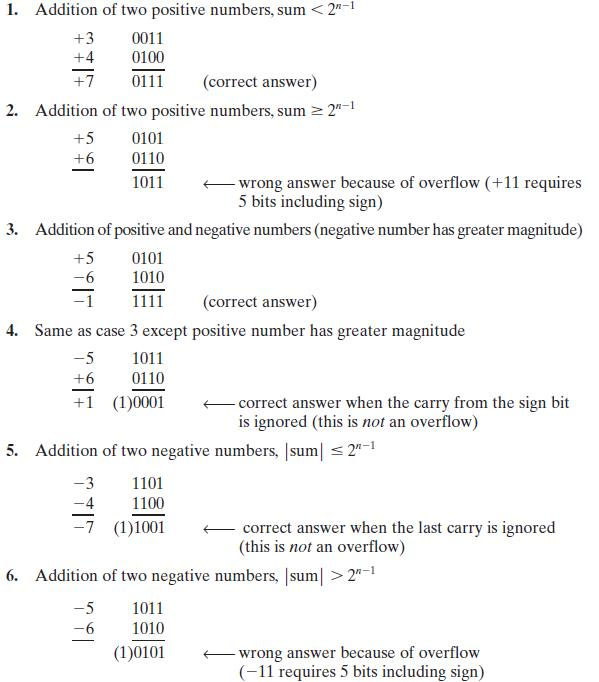
