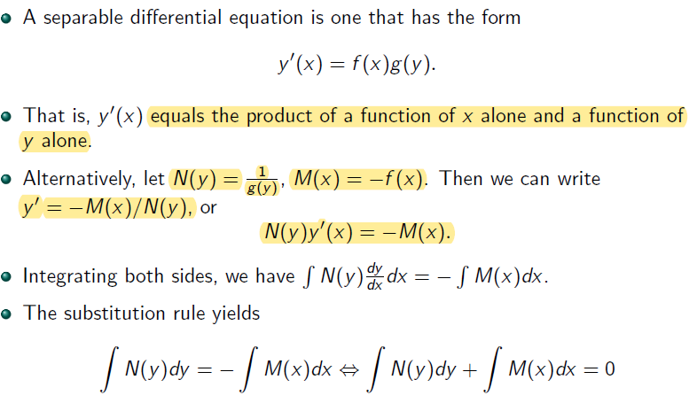
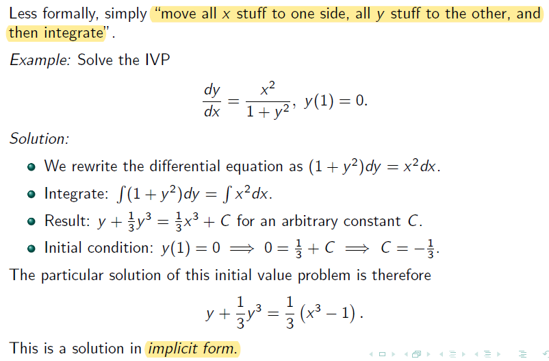
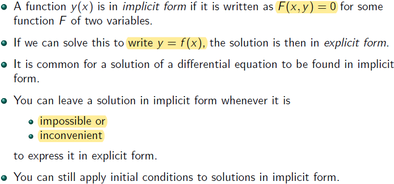
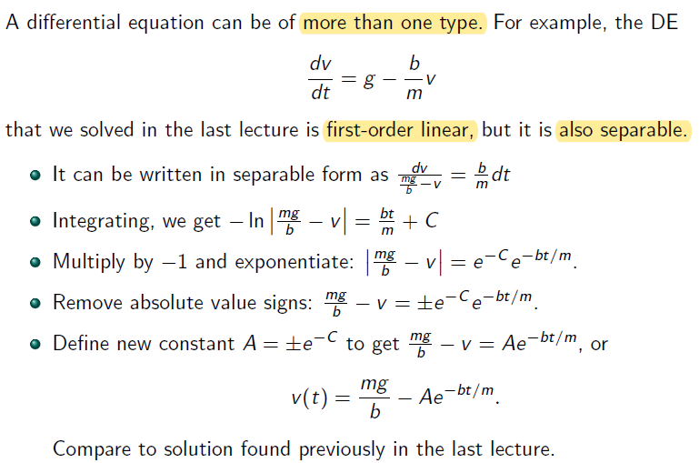
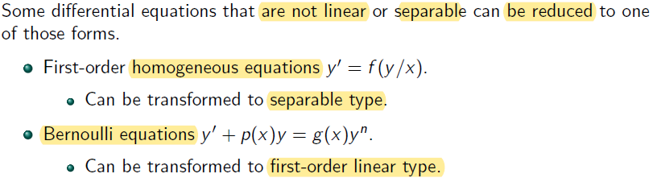
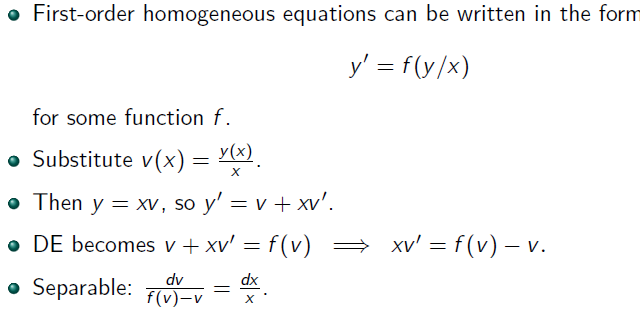
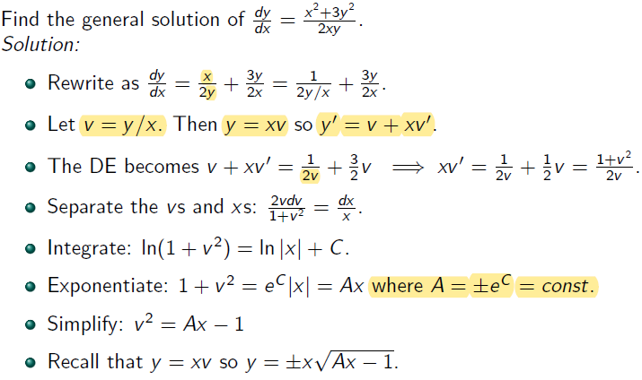
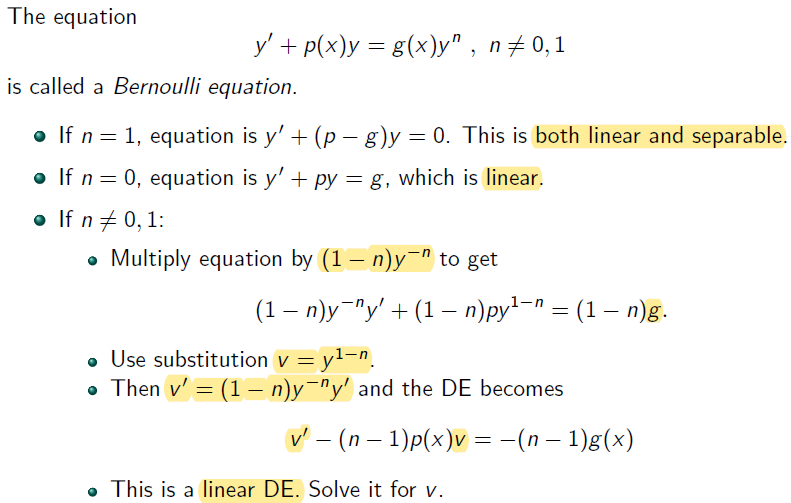
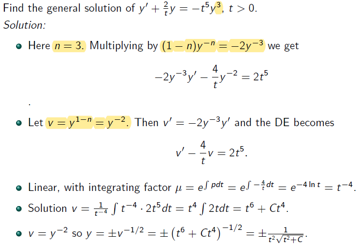

# Lecture 2

## Separable Differential Equations

**dep. var.** $$\rightarrow y$$ 

**ind. var.** $$\rightarrow x$$ 

Alternative way of writing $$y^{'}(x) = f(x)g(y) \rightarrow \frac {dy}{dx} = f(x)g(y)$$

Notice that the second $$dx$$ in $$\int N(y) \frac {dy}{dx} dx$$ is from $$N(y)$$ since $$N(y) = \frac {1}{g(y)}$$ is a function of $$y$$  where $$y$$ is a function of $$x$$

### Example

$$f(x) \rightarrow x^2$$ and $$g(y) \rightarrow \frac {1}{1+y^2}$$ in the $$y^{'}(x) = f(x)g(y)$$ 

## Implicit Form

## DEs of more than one type

- Have more than 1 method to solve

- It is first order linear because it has general form of $$y'(t) + p(t)y(t) = g(t)$$ (remember $$g(t)$$ is a constant / known term depended or not depended on ind. var. $$t$$)
	- rewrite this into $$\frac {dv}{dt} - \frac {b}{m}v = g$$, where $$g$$ can be also written as $$gt^0$$ 

- It is separable $$\rightarrow$$ rewrite this into $$\frac {dy}{dt} = \frac {b}{m}(\frac {mg}{b} - v)$$
	- $$\frac {b}{m}t^0$$ equivalents to $$f(x)$$ in $$y^{'}(x) = f(x)g(y)$$
	- $$\frac {mg}{b} - v$$ equivalents to $$g(y)$$ in $$y^{'}(x) = f(x)g(y)$$

- When $$A = 0$$, $$v(t) = \frac {mg}{b}$$ is not a solution
	- $$\frac {mg}{b} - v = 0$$ is excluded by separation of varibale since $$A = \pm e^{-C}$$ $$e^{-C}$$ can never be 0

## New DEs from old

### First-order Homogeneous Equations

$$xv^{'} = f(v) - v$$

$$\frac {1}{x}(f(v)-v)=v^{'} \rightarrow \frac {1}{x}(f(v)-v)=\frac {dv}{dx}$$ 

#### Example

Rewrite $$\frac {x^2+3y^2}{2xy}$$ into $$\frac {x^2}{2xy} + \frac {3y^2}{2xy}$$

- Separate variable:

$$xv^{'} = \frac {1+v^2}{2v} \rightarrow x \frac {dv}{dx} = \frac {1+v^2}{2v}$$

$$xdv = \frac {1+v^2}{2v}dx \rightarrow \frac {2vdv}{1+v^2} = \frac {dx}{x}$$ 

Integrate both side (use u-sub $$u=1+v^2$$ for the left side)

### Bernoulli Equations

**Side Note**:
- rememeber $$y$$ is  function of $$x$$ 
- mupltiply $$(1-n)y^{-n}$$ to remove $$y^n$$ on the right side

#### Example

