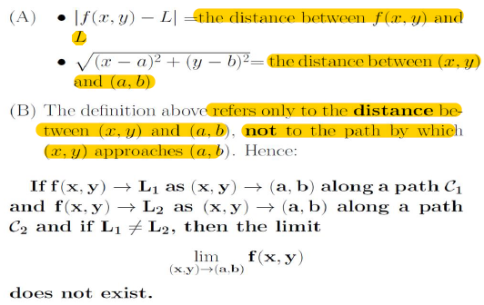
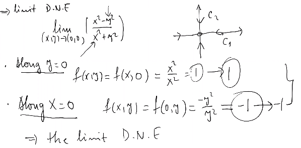
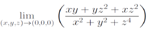
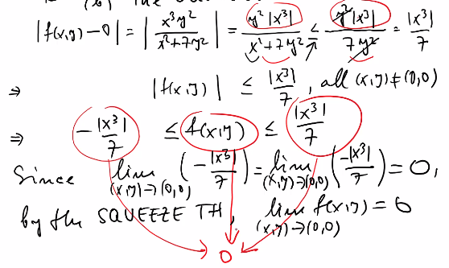
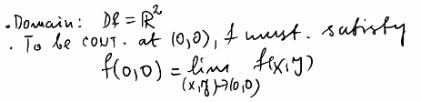
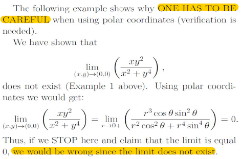

# Lecture 2

## Limits

### Definition (not required)

- Limit of $$f(x,y)$$ as $$(x,y)$$ approaching $$(a,b)$$ equals to number $$L$$ where $$f(x,y)$$ is being as close as number $$L$$

- $$\sqrt {(x-a)^2+(y-b)^2} \rightarrow$$ in 2D is a circle

- $$\delta \rightarrow$$ radius of the circle

- If value for point $$(x,y)$$ is in domain $$D$$ and is within a circle whose origin is $$(a,b)$$ has a radius $$\delta$$, point falls in interval of $$L - \epsilon$$ and $$L + \epsilon$$

- The disntance of $$f(x,y) - L$$ is always smaller than $$\epsilon$$

**Side Note**:

$$|f(x,y) - L| < \epsilon$$

$$-(f(x,y) - L) < \epsilon$$ and $$f(x,y) - L < \epsilon$$

$$L - \epsilon < f(x,y) < L + \epsilon$$

**Remark**:

- $$|f(x,y) - L|$$ only describe the distance between number f(x,y) and L

#### Example (limit do not exist)

General Solution:
- path approach method
	- choose a function that represent a curve or path (line, parabola, etc.)
	- curve / path should cross point $$(a,b)$$
	- choose the curve / path that is relatively simple to approach $$(a,b)$$

**Example 1.1**:

- Solution

Let y

$$y = kx$$

then replace $$y$$ in $$f(x,y)$$ with $$kx$$

$$f(x,y) = f(x,kx) = ... = \frac {k^2}{1+k^4x^2}x$$

calculate the limit as x approach to $$0$$ 

$$\lim\limits_{x \to 0}f(x,kx)$$ = 0

Let x

$$x = y^2$$
 

then

$$f(x,y) = f(y^2, y) = ... = \frac {1}{2}$$

$$\because \frac {1}{2} \neq 0$$
 

$$\therefore$$ Limit D.N.E by definition

**Example 1.2**:

- Solution
	- use **horizontal line / vertical line to approach** to approach $$(a,b)$$ (even $$x$$, $$y$$ axis)

**Example 1.3**:

**Remark**:
- always assume $$(x,y,z)$$ is always close to $$(a,b,c)$$, which is $$(x,y) \neq (a,b)$$
- sometimes, it is better not to directly calculate the limit by substitue the coordinates of limit point (estimate by looking functions' graph)

- Solution

**Example 1.4**: 

- Solution
	- use line with a specific slope $$y = kx$$ 
	- L. hospital rule

#### Examples (limit do exist)

General Solution:
- use path approach method to determine whether if the limit exist
- if the limit exist and can be calculated, the limit from calculation is "**supspect limit**"
	- prove the supspect limit: use either $$\epsilon ~ \delta$$ definition or **Squeeze theorm**

- Example 1 :

- Solution

- apply Squeeze Th.
	- take a function similared to $$f(x,y)$$ (omit the $$x^2$$ term in the bottom)
	- compare with the original function

**Side Note**:

- abs. value of term with even degree is same as the original term

## Continuity

**Notes** (not a single cond.):
- $$f(a,b)$$ must exist, that is, $$(a,b) \in D_f$$ (domain)
- $$\lim\limits_{(x,y) \to (a,b)}$$ must exist
- If both **exist**, they must be equal

#### Examples

- Solutions

### Remark: Polar Coordinates

