# Lecture 3

## Partial Derivatives. Tangent Plane

### Recall: Concept from 100 and 102

- **Definition of Derivaitves** 

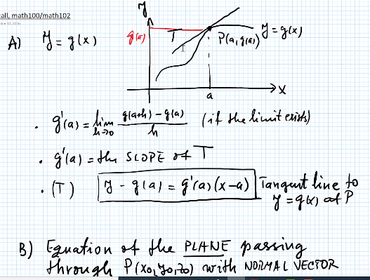

- **Plane and Normal Vector** 
	- There is **only one** plane that passes the point P and normal to the **Normal Vector** $$N$$
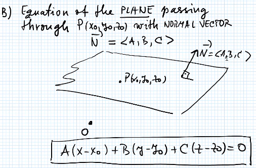

- **Vector Equation** 

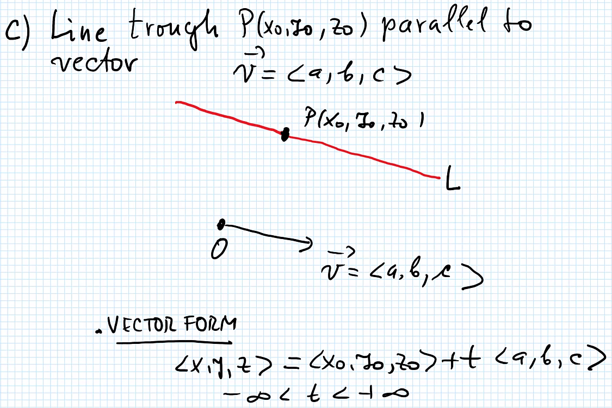

- vector $$V = <a, b, c>$$ is direction vector

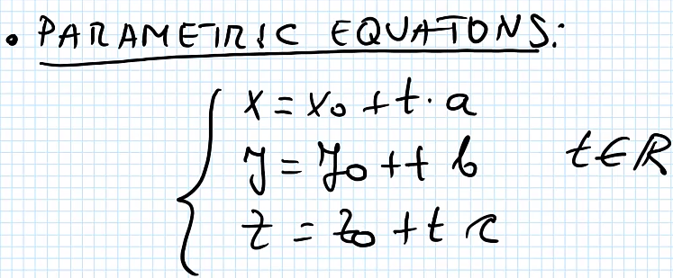

- There is only one plane that pass through point P and process the **Normal Vector** 

### Definition of Partial Derivatives. Tangent Plane

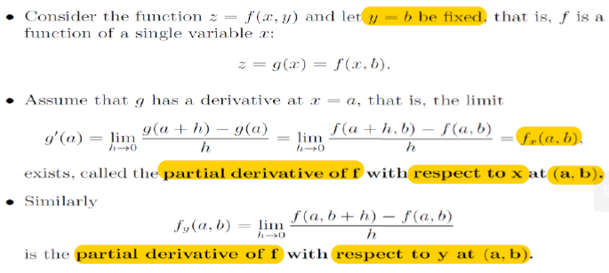

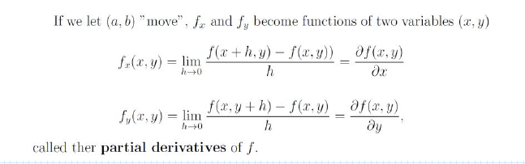

#### Geomertric Interpertation

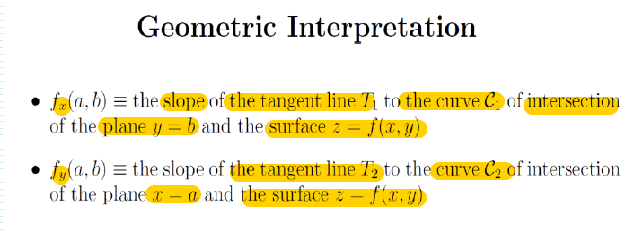

#### Eqautions of $$T_1$$ and $$T_2$$

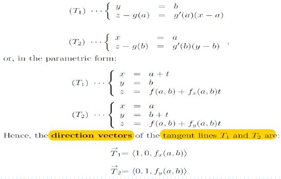

#### Normal Vector $$N$$ and Tangent Plane

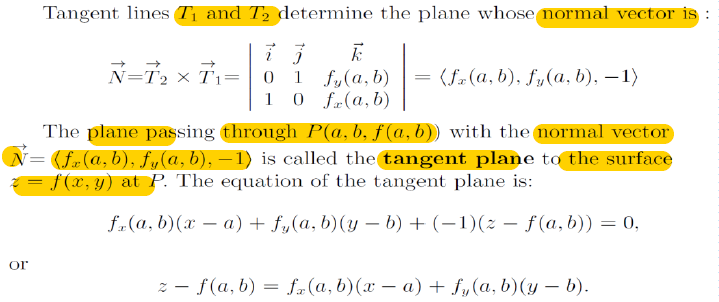

#### Normal Line

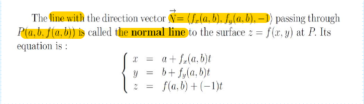

### High Order Partial Derivatives

#### Examples

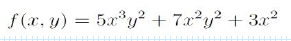

**Solution**:

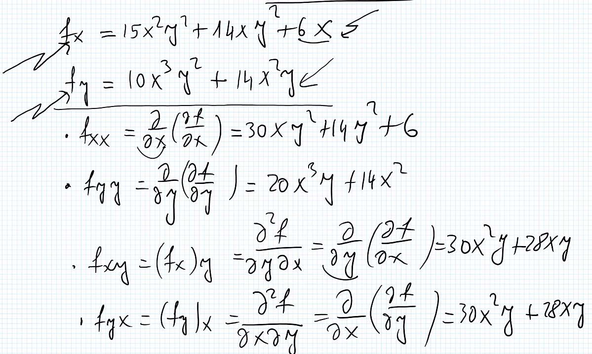

### Clairaut's Theorm

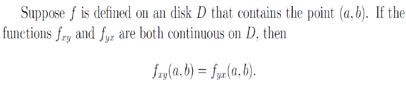
