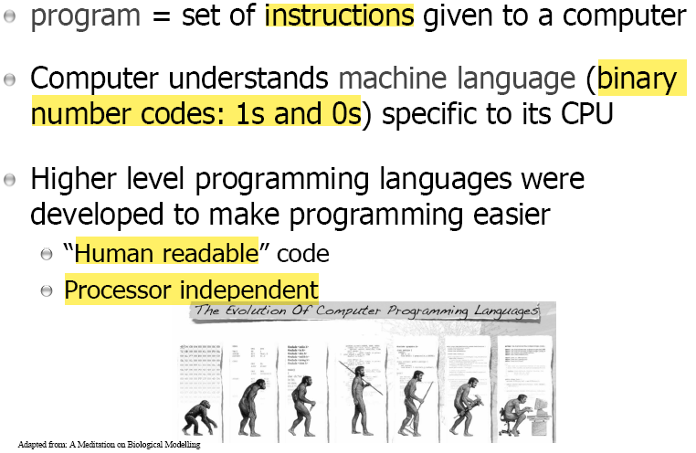
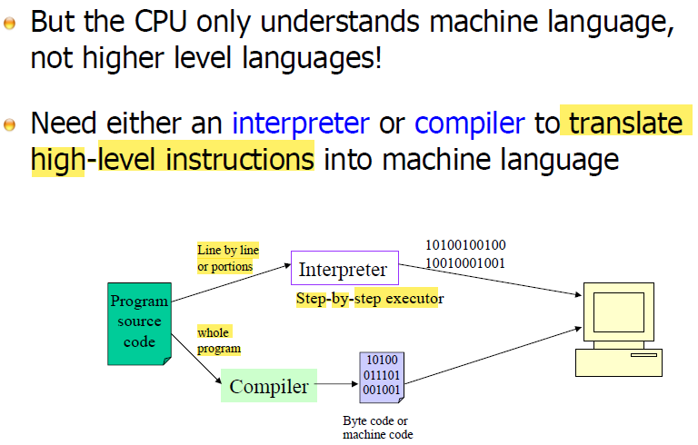
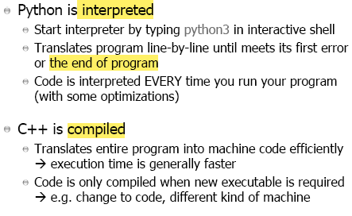
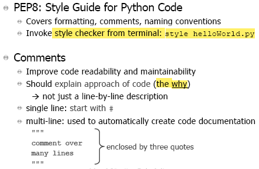
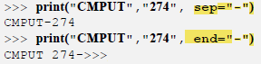
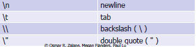
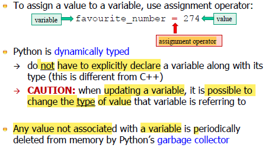
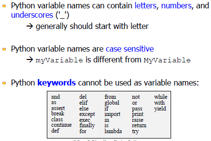
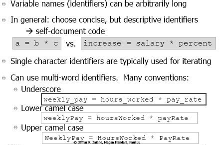

HackED beta: Nov 7th - 8th, finish a project within 24 hours

Nothing for mark until next week

### Programming

give sequence of precise instructions to a computer

different CPU will have differnt machine language (x86 and ARMs)

### Translate Source Code

- **Interpreter**
	- simultaneousness, which interpret and execute line by line (or step by step)

- **Compiler** will translate the source code of the whole program **at once**
	- Analogy: a transaltor translate a book from one language to another one **at once**

### Interpreted and Compiled

Key **advantage** of Interpreter (Python as an example):

- can be run as soon as finishing editing
- easy to fix bug and test something
- quick turn around from source code to being able to run it

For Linux
- **ctrl + d** input an end of file (or end of input) 
	- tell the interpreter that there is nothing more input are given

### Style in Python

**variables** stored in memory $$\rightarrow$$ memory location 

For python, values are stored in main memory (virtual memory)

varibables' name $$\rightarrow$$ variables' **identifier**

$$=$$ is **assignment operator** (not equality)

#### More detail about print()

#### Examples of Escape Sequences

#### Input()

### Values and Variables

 

### Variable Names

### Variables are References

- fall_course as a identifier associated with a variable that has a specific type (the square in the diagram represent variable or type of the variable?)
- assign value $$\rightarrow$$ a pointer will point the variable to a designated value

### Convert Type

**" * "** operation for string represent concatenation repeatedly

#### String Method format()

**Remark**: To use format modifier, need to use "**:**" in {} before adding any modifier

Example: {**:**.1f} $$\rightarrow$$ 1 digit after decimal point

