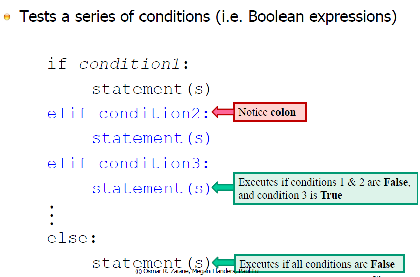

# Lecture 4

## Built-In Type: list

### Sample List Methods

pop - treat list as stack
	- stack - data strcuture, last in first out

### List and Strings

## Decision Making

### Motivation

### Pseudocode

Flow Chart

### Python

### "if" Statement

### "if/else" Statement

### "if/elif/else" Statement

if - first conditional test

elif - second or further conditional test (chain)

else - unconditional test

**Remark (Improve code quality):** 
- make it as short as possible (as simple as possible)
- rethink if/elif/else statement, redesign / simplfy the statment 

### Nested "if" Statements

Question: Use iteration to simply this problem

### Comparing Decimal Numbers

**Remark:** 
- floating point are not repeated
- finite number of digits, precision, and other important properties
- Never compare two floating point for equality (whether is closer together / with tolerance instead)
**Remark:** 

- if nest more than 1 extra level, too complicated and try to simplfy it

## Iteration

### Loops

It is able implement any for loop with while loop that they are equivalent.

Only need one type of loop needed for computability

However, for convenience, both loops exist.

### for Loop

- **iterator** 

#### Example

variable **word** is being reused (assigned to a new value in each iteration)

### range()

**Remark:** 

- using index to access the iterable object is more common in language in C / C++
- somtimes, it is necessary to use indices instead the value / the element especially using parallel list / array, items or elements have some special relationship between different lists / arrays
	- require indices to access multiple lists / arrays at the same time

### while Loop

#### Example - Sentinel Value

#### break

break can be error (better sentinel or other flags)

## **random** Module

dir() - print out all the identifier

namespace - what variables are visible in python
