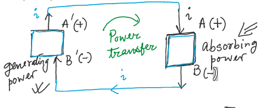
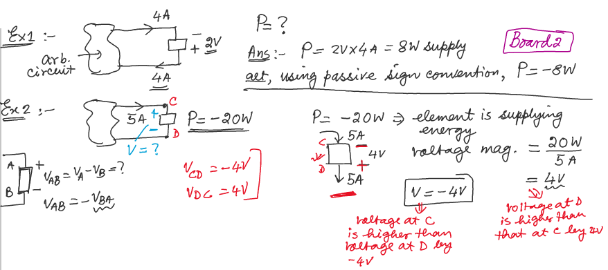
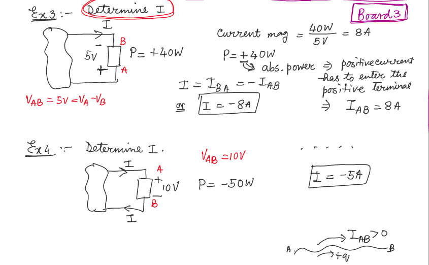
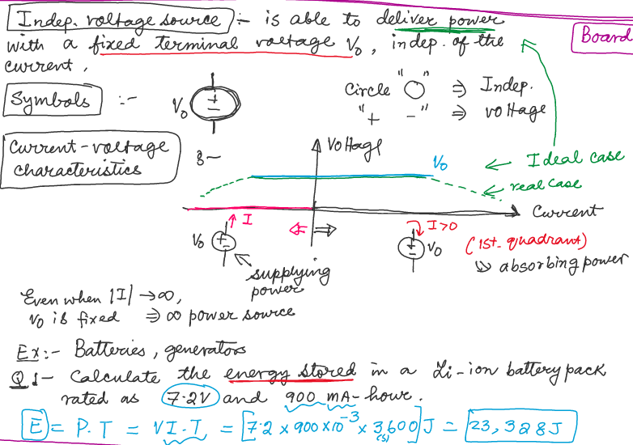
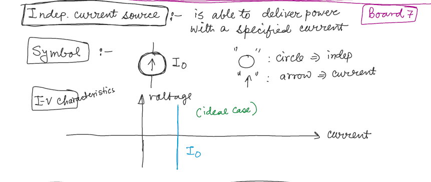
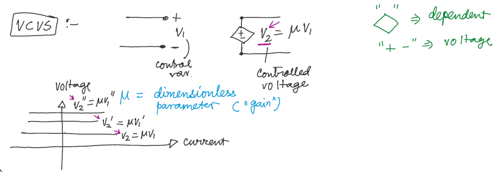
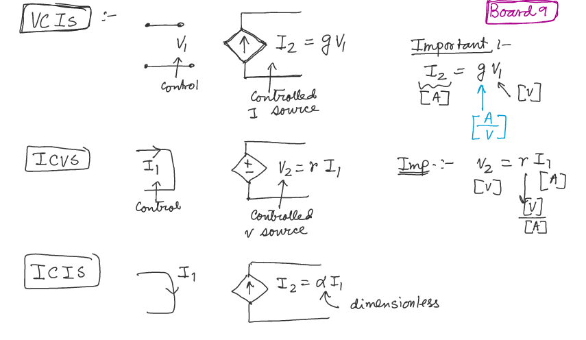
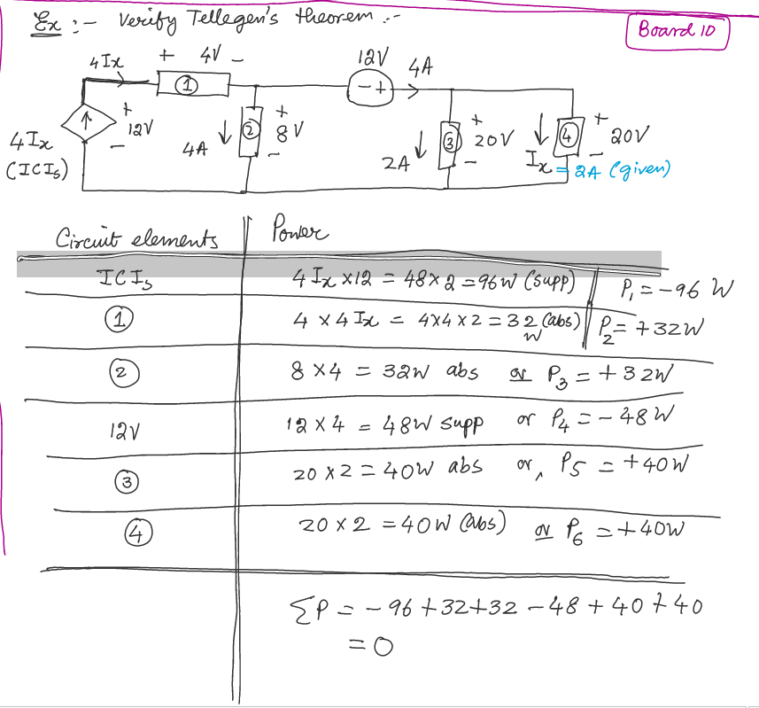

## Sign Convention for Power

- In this diagram:
	- A and B (similarly A' and B') is **voltage terminal** (+ and -)
	- Two elements are translating power each other
	- the current leaves from $$A^{'}$$ is high energy (voltage) carrier
	- the current leaves from $$B$$ is low energy (voltage) carrier

- Power Absorbtion: positve current enters the postive voltage terminal and leaves the negative voltage terminal

- Generating (or supplying) power: positve current leaves the positve voltage terminal and enters the negative voltage terminal

### Passive sign convention for power

- Power absorbtion is represented by **positve sign**
- Power supply is represented by **negative sign**

e.g:
- an elemetn is supplying 5 W power $$\rightarrow$$ power for the element is -5 W
- an elemetn is absorbing 7 W power $$\rightarrow$$ power for the element is +7 W

**Remark**:
- If use absorb / supply to describe the power of an element, don't use sign convention on number
- If use sign convention, vice versa

### Examples

Example 1 and 2

For Ex 1, power is negaitve because 4A current is leaving the positve terminal (element generates and supplys power, which gives more energy to current

**Remark**:
- Voltage doesn't always go from - to +, it depends on what the element is doing
- No voltage difference / power or energy supplied (generated), no current

Example 3 and 4

For current, the + and - indicate the direction of current flow

## Tellegen's Theorem

Conserveration of power in electrical networks

$$\sum P_{absorbed} = \sum P_{supply}$$

or, using passive sign convention (abs power: $$+$$; supply power: $$-$$):

$$\sum P = 0$$

#### Examples

## Circuit Elements

### Acitve Elements

- capable of generating electrical energy

**Remark** :
- Active Elements not always generate electrical energy (depends on circuit)

#### Voltage Source 
- Indep. voltage source
- dependent (controlled) voltage source

#### Current Source

- Indep. current source
- dep. or controlled current source

### Passive Elements

- can **never** generate electrical energy. They can absorb (or disspiate) power
- temporarily store energy that has been given to them

### Independent Voltage Source

- deliver power with a fixed terminal voltage $$V_0$$, indep. of the current

### Independent Current Source

- able to deliver power with a specificed current

### Dependent or Controlled Source

**Unidirectional**:
- can change the cause but not effect
- non-reversible direction

## Electrical Domain

4 options

| Option | Characteristic                    |
|--------|-----------------------------------|
| VCVS   | Voltage controlled voltage source |
| VCIS   | Voltage controlled current source |
| ICVS   | Current controlled voltage source |
| ICIS   | Current controlled current source |

**VCVS** 

**VCIS, ICVS, ICIS** 

#### Examples

