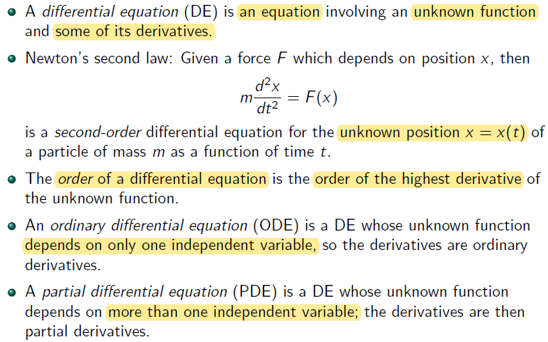
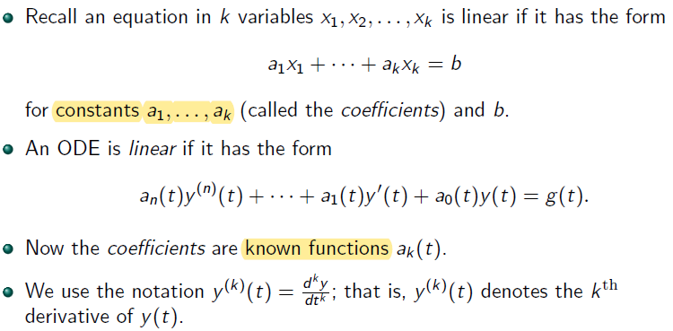
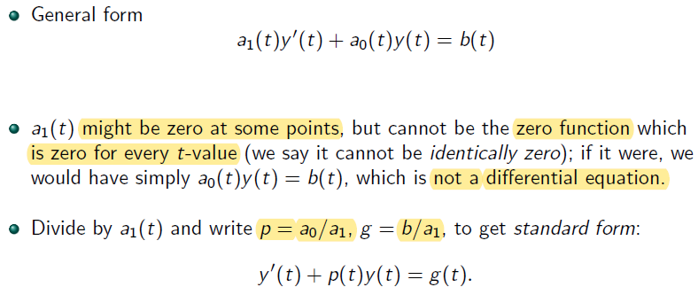
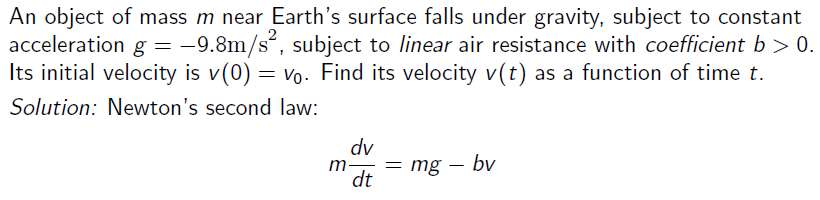
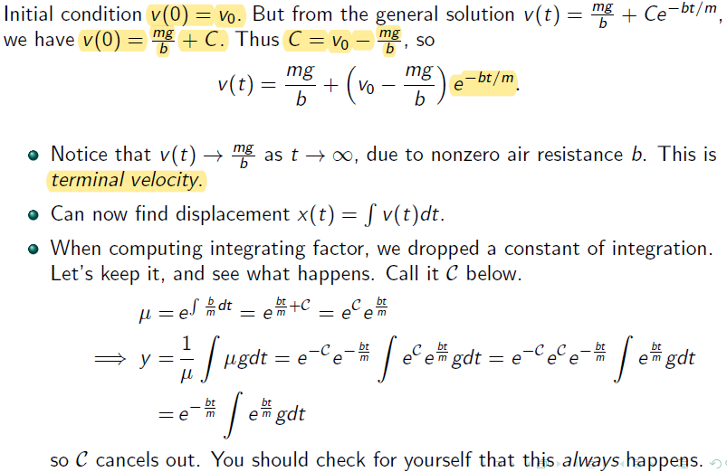
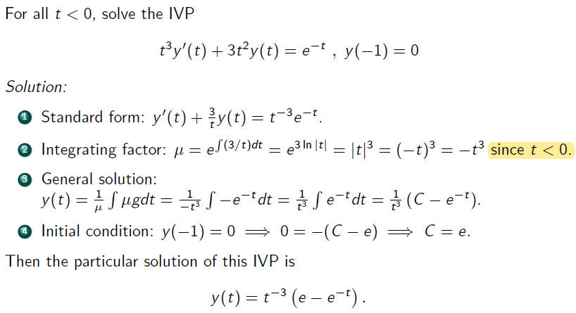

## Differential Equations

In Newton's second law
- t is independent variable
- x is dependent variable

Difference between ODE and PDE:
- ODE's unknown function depends on only one independent varibale while the one of PDE depends on more than one independent varibale

#### Example of PDE and partial derivatives
- unknown function $$f(x,y)$$ has two independent variable $$x$$ and $$y$$
- partial derivative
	- first order - $$\frac{\partial f}{\partial x}$$ and $$\frac{\partial f}{\partial y}$$
	- second order - $$\frac{\partial^2 f}{\partial x^2}$$, $$\frac{\partial^2 f}{\partial y^2}$$ and $$\frac{\partial^2 f}{\partial x\partial y}$$ 

## Linear DEs

## Solutions of DEs and Initial Value Problems

**General Solution** has to include all solution of given DE

**Initial condition** and **boundary condition** are called **side conditions** 

**Rule of Thumb**:
- the order of a DE $$=$$ number of side conditions of DE

#### Examples of IVP and BVP

- IVP - given value at same $$t$$ where $$t = 0$$

$$\begin{cases}
2x^{''} = x(t) \\
x(0) = 1 \\
x^{'}(0) = 2
\end{cases}$$

- BVP - given value at different $$t$$

$$\begin{cases}
2x^{''} = x(t) \\
x(0) = 1 \\
x(1) = 2
\end{cases}$$

## The Simplest DEs: Antiderivatives

Another way to write the general solution using a definite integral, where $$y(t_0)$$ is same as $$C$$

$$y(t) - y(t_0) = \int_{t_0}^{t} g(s)ds$$

And $$y(t_0) = y_0$$ is a given inital condition

### Example

## First-order linear ODEs

### The integrating factor method

**Side Note**:

$$ \mu = e^{\int p(t)dt}$$

$$ \mu (y^{'}(t) + p(t)y(t) = \mu g(t) $$

$$ \mu y^{'}(t) + \mu p(t)y(t) = \mu g(t)$$

Taking derivate of integral of a function equals to the function itself

$$ \because \mu^{'} = \frac{d}{dt} e^{\int p(t)dt} = p(t) e^{\int p(t)dt}$$

$$ \therefore \mu y^{'}(t) + \mu^{'}y(t) = \mu g(t) $$

by mupltiplication

$$ \frac{d}{dt}(\mu (t) y(t)) = \mu g(t)$$

take definite integral of both side

$$ \mu (t)y(t) - \mu (t_0)y(t_0) = \int_{t}^{t_0} \mu (s) g(s)ds$$

**Recall** : 
- the integral of the derviative of a function equal to function itself (remember inital conditions / value or constant C)

**Side Note**: 
- $$ \mu (t_0)y(t_)$$ is merged with constant number C from integral $$ \int_{t}^{t_0} \mu (s) g(s)ds$$
	- if an I.C is given, e.g $$y(t_0) = y_0 \leftarrow$$ value 

### Summary of Integrating Factor Method

### Example

Example 1

**Solution**:
- $$t \rightarrow$$ **ind. var.**; $$v \rightarrow$$ **dep. var.**, depend on $$t$$ 
- unknown $$\rightarrow$$ $$v$$ or $$v(t)$$ 
- constant: $$m, g, b$$

evaluate integrating factor:
- u - subtitution
	- $$u = \frac {bt}{m}$$
	- $$du = \frac {b}{m}dt$$ 
	- $$dt = du \frac {m}{b}$$

Example 2

