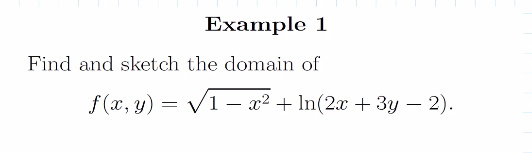
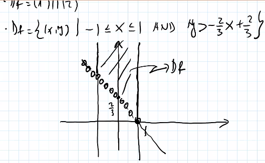
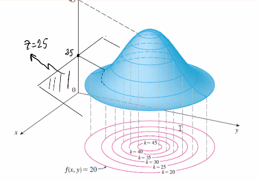
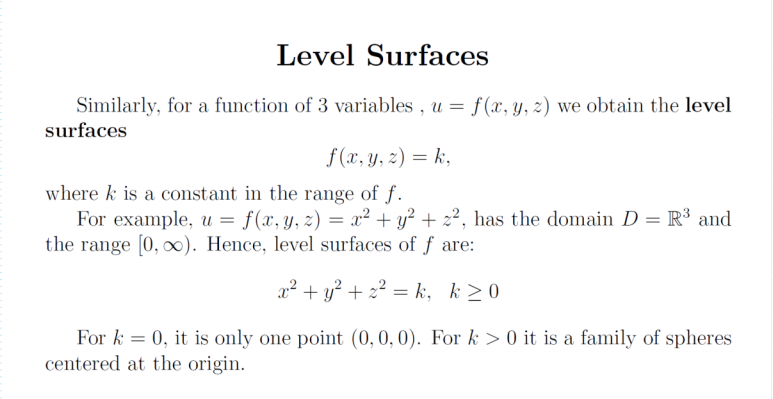

## Functions of Serveral Varibale

**Remark**:

- D is a subset to $$R^n$$ (can be whole sete of $$R^n$$)
- $$f: D \longrightarrow R$$ represents mapping $$D$$ into a real number
- $$(x_1, x_2, ..., x_n)$$ represents any point in D

### Examples of $$f: D \longrightarrow R$$

- $$n = 1$$ and $$n = 2$$

- $$n = 3$$

**Remark**:

- domain and range are two differnt creature
	- domian can be interval, 2D space, 3D space, etc.
	- range of $$f$$ is a single real number

### Examples

- Example 1

**Solution**:

Think, for what's kind of coordinate of x and y need so that $$f(x,y)$$ is a real number

To describe $$y > -\frac{2}{3}x + \frac{2}{3}$$ is the region above the line (exclude the point on the line)

## Graphs of Function of Two Variables

Analogy of using level curves

- consider a topography map
- surface $$G_f$$ as surface of mountain
- take some elevation
- cut the surface of the mountain by horizontal plane
- the cut result will be a curve that connects all point on the same elevation

**Remark**:
- $$(x,y, f(x,y))$$ is a collection of points in $$R^3$$

Example of a level curves

Example of contour map located on $$xy$$-plane (family of level curves)

### Examples

Example 2

## Level Surfaces

