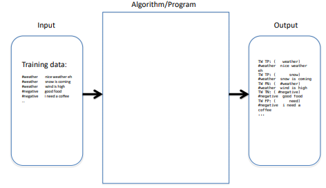
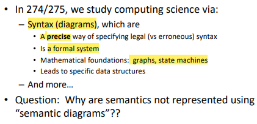

# Lecture 3

**Morning Problem** 

- Download the .pdf file (about the problems) and the .tar.gz file (source code of the problem) 
- Once finish, execute opentestcenter.sh

- Presentation Error, won't deduct mark (incorrect output format, correct result)

- "EOF is not **inherently an error**, but an **unexpected EOF may** cause an error"
	- "EOF" is sent by input "ctrl-d"

## Computational Thinking (CT)

- Problem solving using computation, centered at what digital co1mputer can do on problem solving
	- Tool and foundation of Computer Science $$\rightarrow$$ Computation and Data

- Computation
	- precise operations, instructions need to be implementable, possible, doable.

- **Side Note**: Difference between JPEG and PNG
	- JPEG represents the bit map of the image but also try to implement compression
		- loose file format, which allows the original imagine to be loose to repesent the image in fewer byte (If it's done well, the lost detail can be ignored)
	- PNG represents the bit map of the image without losing any data or information

- Data

In memory, information will be called **data strcutures**. 

In disk, information will be called **file strcutures**. 

### Classifier: About the Weather

#### Recall Classifer

- A software that takes input, and for each input instance, it will say what class the input instance belong to

#### Recall Supervised Learnging

- Somebody or something has to declare about a thing through authority whether is yes (true) or no(false)

#### Target Words

- Hardcoded

- Has some flaw (see Metrics of Goodness)

#### Metrics of Goodness

- False Positive - the test result incorreclty indicates the presence of a condition when it is not present
	- e.g "I need a coffee" is false positive. The classifier classify it as a sentence about 
weather because "need" is in the hardcoded target words but in reality, this sentence is not about
weather

- False Negative - the test result incorreclty fails to indicate the prescence of a condition when it is present
	- e.g "wind is high" is false negaitve. The classifier shouldn't classify this sentence as a sentence about the weather because "wind" is not in the hardcoded target words (although "windy" is in it). However, the classifer, in fact, does classify this sentence as a sentence about weather.

#### Confusion Matrix

- Presents the number of occurrence of TP, TN, FP and FN

### CT Diagram (v1.0)

Input $$\rightarrow$$ Algorithm / Program $$\rightarrow$$ Output

- Input (Training data) contains two columns
	- label
	- string

- Algorithm / Program
	- take string, break into individual word and compare with the hardcoded target word

- Output contains 
	- classfication (TP, TN, FP, FN)

#### Exmaple Problems

**Example Problem 1** 

- Runtime Error $$\rightarrow$$ an error is only visible when the program is running

## What is computer science?

### Why are semantics not repesented using "semantic diagrams"?

- syntax, about the source code file, based on what's in the source code

- semantic, relate to runtime (dynamic) information (e.g input)
